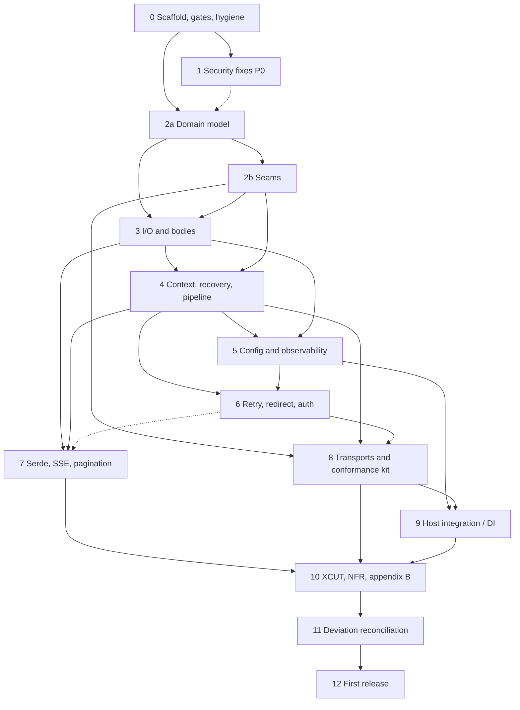

# .NET SDK — v1 Roadmap

**Status:** Draft, for sign-off (2026-09-27). Three decisions under
[Decisions Taken at Sign-off](#decisions-taken-at-sign-off) need the lead's approval before phase 0 opens.

**Purpose:** An index of phases, not an implementation plan. Each row names a phase, the projects and NuGet packages
it touches, the product-spec chapters and requirement IDs it covers, and the design sections it maps to. Each phase
card adds entry and exit criteria and the sibling artifacts it can port. Every phase gets its own
brainstorm → design → plan → checklist cycle when its turn comes, and implementation detail lives in the documents
that cycle produces. **This document never absorbs implementation detail as phases complete.** It changes in exactly
three ways:

- a phase's `sdk-design refs` cell gains a link to that phase's own design document once one exists, **appended to
  the design citation and never replacing it**;
- a wrong cell is corrected in place, with the correction stated and dated;
- a dated entry is appended to `## Phase Status Notes`.

Nothing else is edited. No section here may become a register. There are two registers: `docs/deviations.md`
(created by phase 11) and [`docs/first-release.md`](../../first-release.md), which holds what the release must know.
An aggregate findings or deferral section inside this document is drift, and the `housekeeping` probe's
`registers` check reports it.

**How this port differs from the Ruby and Node roadmaps.** Those roadmaps started from an empty repository. This one
starts from a partial build. At `d45e64b`, five merged pull requests (#3, #4, #6, #8, #9) shipped three packages:
`Dexpace.Sdk.Core`, `Dexpace.Sdk.Http.SystemNet` and `Dexpace.Sdk.Serialization.SystemTextJson`. Together they hold
about 5.8k source lines and 6.7k test lines, covering the HTTP models, bodies, the transport SPI, errors, options,
diagnostics, the pipeline and its policies, auth and pagination. The gap analysis of 2026-09-27 classified the 532
MUSTs in appendix C against that code:

- **137** met;
- **106** partial;
- **174** missing;
- **107** candidates for N/A on .NET;
- **8** unverified.

Whole subsystems are absent: SSE, the recovery chain, the auth resolver with challenges and Digest, header
validation, QueryParams, tri-state PATCH, body and header logging, and layered configuration. Of the missing items,
nine are verified defects severe enough to fix first; phase 1 fixes them. So every phase from 2 through 9 does two
jobs, reconciliation and completion, and its design must start by reading the as-built code its scope covers,
alongside the specification. A clean-room build is not the model here.

**Governing documents.** Six, binding from phase 0 onward, for every phase without exception:

- `docs/product-spec/` is **normative**. It holds 645 numbered requirements across 19 prefixes, in appendix-C
  order: `SEAM`, `HTTP`, `IO`, `BODY`, `CTX`, `PIPE`, `RECOV`, `RETRY`, `REDIR`, `AUTH`, `PAGE`, `SSE`, `SERDE`,
  `OBS`, `CFG`, `TRANSPORT`, `ASYNC`, `XCUT`, `NFR`. There are 532 MUSTs (counting one MUST NOT), 99 SHOULDs and
  14 MAYs.
  - `docs/product-spec/appendix-c-consolidated-normative-requirement-index.md` is the canonical ID index. It
    carries two Ruby "Amended 2026-09-25, C11" notes, which stay as they are.
  - `docs/product-spec/` is byte-identical to the Ruby repository's copy.
- `docs/sdk-design-dotnet/` describes how each spec area maps onto idiomatic .NET. It is non-normative but binding
  by convention, and it is written against the as-built tree.
  - Every section ends with an **As built (d45e64b):** line, and every `partial`, `diverges` or `not built`
    verdict on those lines is scheduled by a phase below.
  - §10 is the deviation ledger. §11 resolves ambiguities in the reference spec. §12 is the requirement coverage
    index.
  - This roadmap cites a deviation by its **topic**, never by its §10 entry number, so a renumbering in phase 11
    cannot silently stale it.
- `docs/styleguide/` is the vendored C# styleguide (`csharp/` 01–15, plus `csharp-aspnetcore/` for the DI package
  and instrumentation).
  - Its **SDK overlay** (`docs/styleguide/README.md`) indexes where this repository departs from the guide.
  - Once phase 0 has run the harvest, the styleguide is queried through `scripts/knowledge`.
  - It is binding except where a note under `docs/knowledge/notes/` records otherwise.
- `docs/knowledge/` is the harvested corpus plus the notes. Today only the `spec` role is seeded. Phase 0 harvests
  the `design` and `styleguide` roles.
- `CLAUDE.md` is the working contract: the conventions, the dependency rule for core, the constraints that bite,
  and the phase workflow. Phase 0 corrects its drift first.
- `docs/README.md` is the ownership table, the frozen-tree list and the `docs/work/` naming rules.

---

## Cross-Cutting Constraints (apply to every phase, not their own phase)

Each constraint is stated normatively somewhere else. This section says what it is, where that statement lives,
and who stands it up.

**1. Quality gates, from phase 0 onward.** The gate set is the table at the top of design §9, and
`docs/sdk-design-dotnet/09-toolchain-and-quality-gates.md` is its authority. Phase 0 stands up every gate that can
run against today's code. A gate whose subject does not exist yet is still wired, but stays inert until that
subject lands, and the phase that lands the subject turns the gate on:

| Gate | Inert until | Turned on by |
|---|---|---|
| `SSE-37` architecture test | the SSE namespace exists | phase 7 |
| Conformance kit | the kit exists | phase 8 |
| NativeAOT smoke consumer | — | phase 0 builds it over the current surface; phase 7 extends it to the Tristate, paging and SSE round trip, and phase 10 completes it |

Every later phase is written under the gates from its first line. A gate is never disabled to land a phase. A
finding that needs a waiver takes a scoped `#pragma` with a why-comment, or a named conformance waiver naming the
requirement ID.

**2. The dependency rule for core, stated precisely.** Design §2.4 is the authority.

- `Dexpace.Sdk.Core` may reference:
  - assemblies in the `Microsoft.NETCore.App` reference pack of its lowest target framework;
  - `Microsoft.Extensions.Logging.Abstractions`, with band-matched versions;
  - build-only packages marked `PrivateAssets="all"`.
- The logging-facade dependency is a recorded deviation, `logging-abstractions-dependency` (sanctioned by
  `SEAM-1`, judged against `NFR-1`). Nobody re-litigates it.
- Adapters are held to the same rule plus `NFR-2`'s "at most one third-party library".
- Phase 0 mechanises the rule as a `*.deps.json` / nuspec dependency-audit test. `CLAUDE.md`'s "BCL-only" sentence
  is corrected to this rule, not relaxed further.

**3. Requirement-ID traceability, with one checklist row per ID in scope.** This roadmap defines the legend, and
every phase uses it verbatim:

| Mark | Meaning |
|---|---|
| ✅ | Implemented and tested. The row names the test, the `[Trait]` category and the file. |
| 🚫 | Not built: a permanent simplification, with the reason and the design §10 topic or §11 resolution it rests on. |
| ⏳ | Deferred. The row names the plan task that will do it (phase, task number and path), or the `docs/first-release.md` entry that owns it. |
| N/A | Not applicable in this port. The row cites the design section that retires it; one of the 107 gap-analysis N/A candidates is **not** N/A until a design section argues it. |

Because the code already exists, a checklist row for a requirement that was "met" at `d45e64b` still needs a named
test that pins it. The gap analysis marks several as met but "(untested)", and those become ✅ only when a test
exists.

**4. Test partition.** `Dexpace.Sdk.Core.Tests` references core and in-memory fakes only, never a transport. That
is `SEAM-2`'s conformance clause, and design §2.3 argues it.

- Phase 0 moves the transport tests into a new `tests/Dexpace.Sdk.Http.SystemNet.Tests`, together with a minimal
  `TcpListener` loopback fixture.
- Phase 8a promotes that fixture into the conformance kit.
- Wire-level tests of the reference transport are allowed from phase 1 onward, but only in the transport's own test
  project.
- Tests carry `[Trait("Category", …)]`: `Unit`, `Integration`, `Conformance`, `AotSmoke` (design §9.3), and
  `Security` for the phase-1 regression tests.

**5. Phase-1 regression tests are permanent.** Each security fix in phase 1 lands with a regression test tagged
`Security`. Later phases restructure the code those tests cover: 2a rebuilds `Headers`, 4c changes the policy
signature, 5b rewrites the redactor, and 6b rewrites the redirect policy. Each such phase must keep the phase-1
tests green, or move them without weakening them. Deleting or loosening a `Security` test is a review-blocking
change.

**6. Styleguide-versus-design conflicts are decided once, then recorded as notes.** Phase 0's harvest turns each
overlay row in `docs/styleguide/README.md` into a `Conflicts` entry. Phase 0 then writes the note under
`docs/knowledge/notes/` (role `review`, citing the harvested key) for every conflict this port **keeps**. A
conflict the port **conforms** to needs no note; the code changes instead.

| Styleguide rule | Decision | Owner |
|---|---|---|
| `I`-prefix on public interfaces | kept (the overlay's recorded departure; design §10 topic `styleguide-naming`) | phase 0 |
| `Async` suffix on public members | kept (same) | phase 0 |
| `CA2007` | re-enabled | phase 0 |
| `ImplicitUsings` | turned off, with a committed `GlobalUsings.cs` (design §9.4) | phase 0 |
| xUnit v3 on Microsoft.Testing.Platform | migrated to | phase 0 |
| `MA0051` 70-line cap | wired | phase 0 |
| .NET 10 target | conformed if decision D1 is approved | phase 0 |
| `CA1062` | kept dialled down, with its rationale (design §9.4) | phase 0 |

**7. Register discipline.** There are two registers: `docs/deviations.md`, the as-built audit of design §10, and
`docs/first-release.md`. Nothing else is registered.

- **A finding goes to its owner when it is found:**
  - a numbered task in the plan of the phase whose scope it falls in;
  - a bullet on phase 11's inbound list, in a dated status note below, when it is audit-or-repair work against a
    phase that is already planned or closed;
  - a `docs/first-release.md` entry, when it belongs to the release;
  - or simply the fix.
- **Postponed work names its owner**: a plan task (phase, task number, path) or a `docs/first-release.md` entry,
  never a bare ID.
- **A deviation** goes first to the phase design's `## Deviation Ledger` (IDs `P<N>-<n>`), then into design §10,
  then into the audit in `docs/deviations.md`.

**8. Pre-1.0 breaking changes are free, but visible.** Nothing is published, so reworking a public signature is
allowed. Examples: the policy signature in §5.1, `IHttpClient.Execute`'s options and token in §3.2, and `Method`
becoming a `sealed record` in §4. From phase 0 onward, every such change:

- shows up as a `PublicAPI.Unshipped.txt` diff under `RS0016`/`RS0017`;
- gets a `CHANGELOG.md` `[Unreleased]` line in the same pull request.

`PublicAPI.Shipped.txt` is populated once, at the first release (phase 12).

**9. Pointers, not copies.** A phase document cites these, and never copies them:

- the domain-model construction pattern (design §4);
- the constraints that bite (`CLAUDE.md`; design §3.2's `HttpClient` gotchas and §8.3's prohibitions);
- the P1–P14 porting method (design chapter 00).

**10. Porting from the siblings is transcription, not copying.** Neither sibling has language-neutral test vectors.
Their fixtures are Ruby modules (`ruby-sdk/gems/dexpace-core/test/support/*_fixtures.rb`) and TypeScript tables.
Each phase card below names what to port. The rules:

- Port the **case tables** (inputs → expected outputs, keyed by requirement ID) into xUnit `[Theory]`/`MemberData`.
- Where a phase ports a large table (SSE, the redirect matrix, media types, redaction), it may extract the vectors
  into JSON under `tests/vectors/` so the suite loads them as data. That makes the vectors upstreamable to the
  siblings.
- Never port a test that asserts a host-language fact: Ruby's `*/matrix_facts_test.rb` files, or Node's
  runtime-floor probes.
- Every ported test cites its source path in a header comment (`// Ported from ruby-sdk@5b17395
  gems/dexpace-core/test/dexpace/sse/line_reader_test.rb`).

---

## Decisions Taken at Sign-off

Three decisions have no other owner. This roadmap proposes an answer to each. Phase 0's design records the lead's
ruling and quotes it.

**D1 — the target-framework floor and the .NET 8 end of support (2026-11-10), 44 days after this roadmap.**

- **Proposed:** raise the floor to **`net10.0` only, in phase 0**, as a single edit to a centralised
  `TargetFrameworks` in `Directory.Build.props`.
- **Why now rather than at 2026-11-10:**
  - Nothing is published, so no consumer is stranded.
  - A v1 that clears this roadmap cannot plausibly ship before 2026-11-10. If it did, it would support `net8.0`
    for weeks.
  - Every `net8.0` accommodation the design carries is work that the floor rise throws away:
    - the band-matched `Microsoft.Extensions.Logging.Abstractions` 8.0.x group, and its `DiagnosticSource` closure
      (§2.4);
    - the in-box-versus-package split for `System.IO.Pipelines`, `System.Net.ServerSentEvents` and
      `System.Linq.AsyncEnumerable` (§9.2);
    - the `RespectNullableAnnotations` gap (§7.3);
    - the second test-runtime leg in CI.
  - It also conforms the code to the styleguide's own ".NET 10 LTS" rule (`docs/styleguide/csharp/01-formatting-and-tooling.md`),
    which retires an overlay row.
  - `NFR-10` is satisfied either way: the floor is declared and targeted.
- **The cost:** a consumer application still on .NET 8 after its end of support cannot take v1. The alternative
  is to keep `net8.0;net10.0` (design §2.3 as written), multi-target from phase 0, and drop `net8.0` in the first
  phase whose branch opens on or after 2026-11-10. That is also a legitimate choice. It must be made in phase 0,
  because the TFM centralisation, the logging-facade band and the CI runtime matrix are all phase-0 edits.
- **If D1 is approved,** phase 0 files a dated correction against design §2.3 and §9.2, whose text assumes
  `net8.0;net10.0`, and against the overlay's TFM row.

**D2 — where the 13 legacy `docs/superpowers/` documents go.** These are the platform design, ten slice designs
and two plans from 2026-06-14/15. They record the decisions behind PRs #3–#9, and the design chapters cite them
57 times.

- **Proposed:** a delivery of their own, **`docs/work/foundation/`**, a sibling of `mvp/` that predates it. The
  housekeeping skill's rule ("a later effort becomes a sibling of it") admits an earlier one.
- The files are flat under the delivery directory, because none maps onto a phase of this roadmap.
- The mechanics are phase 0's:
  - `dotnet run --project .claude/skills/housekeeping/src -- apply --delivery foundation` (dry run), then
    `--write`, as a `git mv`-only commit;
  - then a second commit that repoints every `docs/superpowers/specs/…` and `…/plans/…` citation in design
    chapters 00–09 and in the housekeeping tests' fixtures. This is a human edit to the design tree, dated and
    stated. The frozen list binds tools, not reviewed commits.
- `docs/superpowers/README.md` counts them correctly (eleven specs plus two plans) as of this roadmap.

**D3 — webhooks and a second transport, the two open scope questions.**

- **Webhooks.** Design §7.4 describes Standard Webhooks HMAC verification, which no requirement prefix covers.
  Neither sibling ships it.
  - **Proposed:** not a v1 phase. It becomes a `docs/first-release.md` post-release entry with a trigger: the
    first consuming SDK that receives webhooks.
  - Core keeps the namespace free: no `Webhooks/` folder lands.
- **Second transport.** Design §2.2 argues there should be no second first-party transport, because
  `HttpMessageHandler` is the ecosystem's connection seam and a second adapter would prove no new property.
  - **Proposed:** phase 8's segmentation design confirms that argument against the kit's results rather than
    reopening it.
  - The kit's transport-agnosticism is proven by running it against `DelegateHttpClient` (§3.2) as well as against
    `SystemNetHttpClient`, not by building a second product.
  - A second transport is a post-release trigger in `docs/first-release.md`.

---

## Phase List

Spec chapters are cited by number (ch.04 is `HTTP`, and so on). A backticked chapter path is used only where every
ID in the clause is stated in that chapter.

| Phase | Name | Projects / packages | Product-spec refs | sdk-design refs |
|---|---|---|---|---|
| 0 | Scaffold, Quality Gates and Repository Hygiene | repository root, `.github/`, `tools/Dexpace.Tools.sln`, all three existing `src/` projects, the new `tests/Dexpace.Sdk.Http.SystemNet.Tests` and `tests/Dexpace.Sdk.AotSmoke` (NativeAOT-published, non-packable), plus a new non-packable `tests/Dexpace.Sdk.TestSupport` for shared fakes | ch.20 — `NFR-1`–`NFR-17` stood up as machinery; none is closed here (phase 10 dispositions them) | §2.3, §2.4, §9, §9.1–§9.4 |
| 1 | Security and Robustness Fixes (P0) | `Dexpace.Sdk.Core`, `Dexpace.Sdk.Http.SystemNet` | The nine defects S1–S9 below: `HTTP-17`, `HTTP-18`, `HTTP-26`, `XCUT-18`, `TRANSPORT-1`, `TRANSPORT-11`, `TRANSPORT-12`, `TRANSPORT-22`, `TRANSPORT-27`, `REDIR-7`, `REDIR-8`, `REDIR-9`, `REDIR-12`, `XCUT-17`, `AUTH-28`, `XCUT-16`, `OBS-11`–`OBS-15`, `XCUT-19`, `RETRY-44`, `PIPE-16`, `RETRY-18`, `RECOV-26`, `BODY-31`, `RECOV-15`, `HTTP-52`, `BODY-30` | §3.2, §4.1, §4.2, §5.1, §6.1–§6.3, §8.1 |
| 2 | Domain Model and Seam Foundations (2a domain model · 2b seams) | `Dexpace.Sdk.Core`, and `Dexpace.Sdk.Http.SystemNet` for 2a's `Response` construction, public header predicate and wire casing and 2b's SPI signature change (corrected 2026-09-29, per the lead's ruling of 2026-09-29 on open question 3 of the [phase 2 segmentation design](phase2/2026-09-29-phase2-segmentation-design.md): this cell read "for the SPI signature change only", but 2a also edits the adapter) | ch.02 and ch.04 — `HTTP-1`–`HTTP-35`, `HTTP-46`–`HTTP-50`, `HTTP-53` (41 IDs; corrected 2026-09-29, per the same ruling: this cell read "ch.04", but `HTTP-1` and `HTTP-2` are stated in ch.02); ch.03 and ch.02 — `SEAM-1`–`SEAM-30` (30); the IDs for `SEAM-5`/`SEAM-6`'s DI half travel to phase 9 | §3.4, §3.5, §3.6, §4, §4.1–§4.4, and §1, §3.1–§3.3, §3.7 (corrected 2026-09-29, per the same ruling: this cell omitted the sections that argue `SEAM-3`/`SEAM-4`, `SEAM-11`–`SEAM-18`, `SEAM-24`, `SEAM-25` and `SEAM-30`); segmentation design: [`phase2/2026-09-29-phase2-segmentation-design.md`](phase2/2026-09-29-phase2-segmentation-design.md); 2a design: [`phase2/phase2a/2026-09-29-phase2a-domain-model-design.md`](phase2/phase2a/2026-09-29-phase2a-domain-model-design.md); 2a plan: [`phase2/phase2a/2026-09-30-phase2a-domain-model.md`](phase2/phase2a/2026-09-30-phase2a-domain-model.md); 2b design: [`phase2/phase2b/2026-09-30-phase2b-seams-design.md`](phase2/phase2b/2026-09-30-phase2b-seams-design.md); 2b plan: [`phase2/phase2b/2026-09-30-phase2b-seams.md`](phase2/phase2b/2026-09-30-phase2b-seams.md) |
| 3 | I/O and Body Lifecycle (3a I/O · 3b bodies) | `Dexpace.Sdk.Core` | ch.05 — `IO-1`–`IO-42` (42); ch.06 — `BODY-1`–`BODY-37` (37), plus `HTTP-36`–`HTTP-45`, `HTTP-51`, `HTTP-52` (12), which are numbered jointly into that chapter; the work for `HTTP-44`/`HTTP-45` lands in 7a | §3.1, §3.7, §4.5; [3a design](phase3/phase3a/2026-10-02-phase3a-io-design.md) |
| 4 | Execution Context, Recovery Chain and Pipeline Rework (4a context · 4b recovery · 4c pipeline) | `Dexpace.Sdk.Core` | ch.07 — `CTX-1`–`CTX-20` (20); ch.08 §8.2 and appendix C — `RECOV-1`–`RECOV-34` (34); ch.08 §8.1 — `PIPE-1`–`PIPE-40` (40) | §5.1–§5.4; [4a design](phase4/phase4a/2026-10-05-phase4a-context-design.md), [4b design](phase4/phase4b/2026-10-05-phase4b-recovery-design.md), [4c design](phase4/phase4c/2026-10-05-phase4c-pipeline-design.md) |
| 5 | Configuration Model and Observability (5a configuration · 5b logging and redaction · 5c tracing and metrics) | `Dexpace.Sdk.Core`, and `Dexpace.Sdk.Http.SystemNet` for `traceparent` handling | ch.16 — `CFG-8`, `CFG-9`, `CFG-12`, `CFG-13`, `CFG-15`–`CFG-36` (the binding tier travels to phase 9); ch.15 — `OBS-1`–`OBS-40` (40) | §3.8, §8.1–§8.3; [5a design](phase5/phase5a/2026-10-07-phase5a-configuration-design.md), [5b design](phase5/phase5b/2026-10-07-phase5b-logging-design.md), [5c design](phase5/phase5c/2026-10-07-phase5c-tracing-design.md) |
| 6 | Retry, Redirect and Authentication Completion (6a retry · 6b redirect · 6c auth) | `Dexpace.Sdk.Core` | ch.09 — `RETRY-1`–`RETRY-45` (45); ch.10 — `REDIR-1`–`REDIR-28` (28); ch.11 — `AUTH-1`–`AUTH-38` (38); plus the work for the recovery-stack IDs `RECOV-17`–`RECOV-30` and `RECOV-34`, whose rows stay in phase 4 as ⏳ | §6.1–§6.3, §8.3; [6a design](phase6/phase6a/2026-10-08-phase6a-retry-design.md), [6a plan](phase6/phase6a/2026-10-08-phase6a-retry.md), [6b design](phase6/phase6b/2026-10-08-phase6b-redirect-design.md), [6b plan](phase6/phase6b/2026-10-08-phase6b-redirect.md), [6c design](phase6/phase6c/2026-10-08-phase6c-auth-design.md), [6c plan](phase6/phase6c/2026-10-08-phase6c-auth.md), [6a checklist](phase6/phase6a/2026-10-08-phase6a-retry-checklist.md) |
| 7 | Serde, SSE and Pagination (7a serde · 7b SSE · 7c pagination) | `Dexpace.Sdk.Core`, `Dexpace.Sdk.Serialization.SystemTextJson` | ch.14 — `SERDE-1`–`SERDE-30` (30); ch.13 — `SSE-1`–`SSE-41` (41); ch.12 — `PAGE-1`–`PAGE-36` (36) | §3.4, §7.1–§7.3 |
| 8 | Transports and the Conformance Kit (8a kit · 8b reference-transport hardening) | the new `Dexpace.Sdk.Conformance` package (phase 8 owns its csproj, version and first release), `Dexpace.Sdk.Http.SystemNet`, `tests/Dexpace.Sdk.Http.SystemNet.Tests` | ch.17 — `TRANSPORT-1`–`TRANSPORT-30` (30); ch.18 — `ASYNC-1`–`ASYNC-22` (22) | §2.1, §2.2, §3.2, §3.3, §3.7, §9.3 |
| 9 | Host Integration | the new `Dexpace.Sdk.Extensions.DependencyInjection` package, plus its test project | ch.16 — `CFG-1`–`CFG-7`, `CFG-10`, `CFG-11`, `CFG-14`, `CFG-37`, `CFG-38`; `SEAM-5` and `SEAM-6`'s single-registration check (rows carried from 2b); `TRANSPORT-1` for named clients; `XCUT-10`'s one-retry-layer rule | §2.1, §3.6, §8.2 |
| 10 | Cross-Cutting Invariants and Conformance | every package, audited; `Dexpace.Sdk.Conformance` gains the invariant, packaging and codec suites, but phase 10 does not own that package's csproj or its release | ch.19 — `XCUT-1`–`XCUT-24` (24); ch.20 — `NFR-1`–`NFR-17` (17); appendix B (61 items) | §9, §9.2, §9.3, §11 |
| 11 | Deviation Reconciliation | every package; the audit leads, and the phase ships code wherever the audit finds a defect | appendix C — every ID named by a design §10 entry; the §11 resolutions; the §12 coverage index | §10, §11, §12 |
| 12 | First Release | every package; `.github/workflows/release.yml`; `docs/sdk-documentation/` | `NFR-4`'s baseline, and the release halves of `NFR-12` and `NFR-16` | §2.3, §9.1, §9.2 |

**The rows account for all 645 IDs.**

- Phases 2–10 cover the 19 prefixes, each ID exactly once, with the CFG split between 5 and 9 stated in their rows.
- Phase 1 **owns no ID rows**. Its checklist has one row per defect (S1–S9), and each ID it touches keeps its row
  in the owning phase's checklist, which cites phase 1's `Security` test as the evidence for the clause phase 1
  closed.
- Phase 0 carries no requirement scope.
- Phases 11 and 12 re-audit rows. They do not own any.

### Ordering rationale

1. **Gates come first.** At `d45e64b` the build is red (`NU1902`), so no phase can land.
2. **The P0 security fixes come second, before any rework.** Every one of them is live in the code as merged today,
   and each fix is small against today's shapes. The same fixes done inside the reworks would wait weeks.
3. **Then dependency order, in Ruby's order.** The domain model and seams (2) come first, then I/O and bodies (3),
   then context, recovery and pipeline (4), because every pillar attaches there.
4. **Configuration and observability (5) come before resilience (6).** This is Ruby's reordering, and it holds on
   .NET for its surviving reasons:
   - retry's pacing needs §8.2's shared RFC 1123 parser (`CFG-29`–`CFG-31`) and §8.3's synchronous cancellable wait
     (`CFG-15`, `CFG-17`);
   - retry and redirect emit per-attempt and per-hop events that phase 5 defines.

   Ruby's third reason, the clock, is weaker here, because `TimeProvider` is already threaded through the
   policies.
5. **Serde, SSE and pagination (7) depend on 3 and 4, not on 6.** `SSE-37` and ch.12's serde-agnostic engine keep
   them independent, so 6 before 7 is a **convenience**.
6. **Transports (8) wait for the authorities they defer to.** `TRANSPORT-1` and `TRANSPORT-2` require the native
   client's redirects and retries to be off, which presupposes `PIPE`, `REDIR` and `RETRY` as the single
   authority.
7. **Host integration (9) comes after 5 and 8.** It binds the options records that 5a makes immutable, and it
   wires the handler rules that 8b finalises.
8. **Phases 10–12 close the roadmap by construction.**

**Coupling obligations that no single phase owns.**

1. **`CTX-14`/`CTX-15` and `OBS-25`/`OBS-26` are one shape.** Phase 4a fixes the correlation bundle
   (`ActivityContext`, §5.4). Phase 5c populates it. Phase 5c may not redefine it.
2. **`REDIR-11`/`REDIR-24` and auth stamping.** Phase 4c fixes the **seed origin on the call-scoped context** (§5.1,
   §6.2). Phase 6b's redirect loop and phase 6c's stamping both read it. Phase 1's S3 fix is an interim form of
   the same rule, and 6b replaces it.
3. **`RETRY` needs `RECOV` (4b), `PIPE` (4c) and `CFG` (5a).** The recovery-stack engine (`RECOV-17`–`RECOV-30`,
   `RECOV-34`) is built in 6a, with the one shared calculator that `RETRY-13` requires. Phase 4b builds only the
   primitives.
4. **`TRANSPORT` needs `SEAM` (2b), `PIPE` (4c), `REDIR` (6b) and `RETRY` (6a) fixed.** It needs them as authority
   contracts, not as call targets.
5. **The real synchronous path runs through three phases, one strand each:**
   - 2b changes `IHttpClient.Execute`'s signature;
   - 4c gives the pipeline a real `Process`/`Run`;
   - 8b makes `SystemNetHttpClient.Execute` call `HttpClient.Send`.

   Until 8b lands, the synchronous path is still sync-over-async. The 2b and 4c checklists mark `SEAM-11` and
   `PIPE-28` ⏳ against 8b.

A stated bottom-up order is not self-enforcing. If a phase finds a dependency edge that inverts this order, it
records the edge in a dated status note here **and** in each affected phase's Prerequisite section, and the phases
run in the real order.

### Dependency graph

Solid edges are dependencies; dashed edges are convenience orderings only.



Phase 1 depends only on phase 0's first task, the green build. It may run in parallel with the rest of phase 0.

### Segmentation rule

A build phase (1 through 9) gets a segmentation design at `docs/work/mvp/phaseN/<date>-phaseN-segmentation-design.md`,
before any sub-phase design, if any of these hold:

- its ID count clearly exceeds an earlier phase's;
- it spans more than one ID-bearing spec chapter;
- it ships more than one package.

The segmentation design decides the cut and the order, and says for each sub-phase whether its order is a
**dependency** or a **convenience**. Node's phase 6 silently reimposed a linear chain, and this rule exists to stop
that recurring. Sub-phase letters in the table are **expected until the segmentation design decides**.

- **Phase 2**, 2a then 2b. This is a dependency: `SEAM-29`'s construction contract and the `RequestOptions` type
  that 2b's SPI signature carries are 2a's.
- **Phase 3**, 3a then 3b. This is a dependency: the tee (`IO-25`–`IO-29`) and the exact-length copy come before
  the logging wrappers (`BODY-17`–`BODY-28`).
- **Phase 4**, 4a / 4b / 4c. This is a convenience, as Ruby found: no `RECOV` or `PIPE` requirement consumes `CTX`.
  One caution: 4c's call-scoped `PipelineContext` is the carrier for 4a's bundle, so 4a and 4c must agree on its
  shape, even though neither blocks the other.
- **Phase 5**, 5a / 5b / 5c. 5b's body logging depends on 3b; 5a leading 5b is soft.
- **Phase 6**, 6a / 6b / 6c. These are independent segments over contracts that 4c has already fixed. The
  convergence point is an end-to-end credential-leak test, and 6b owns it. Budget for 111 IDs plus the 15 `RECOV`
  IDs whose work travels here.
- **Phase 7**, 7a / 7b / 7c. These are independent by `SSE-37` and ch.12.
- **Phase 8**, 8a then 8b. This is a dependency: 8b is proven by 8a's kit.

**Gap IDs a phase must read out of the specification itself.** `scripts/knowledge --coverage` reports 30 IDs that
have no substantive entry in the corpus:

| IDs | Phase |
|---|---|
| `SEAM-15`, `SEAM-20`, `SEAM-22`, `SEAM-23`, `SEAM-28` | 2b |
| `IO-6`, `IO-32`–`IO-35`, `BODY-6`, `BODY-7` | 3 |
| `RECOV-17`–`RECOV-34` | 4b and 6a |

For most of them, appendix C is the **only** normative statement. The chapters do not carry them. Each such phase
budgets the reading in its design.

---

## Phase Cards

Each card gives the scope, as the gap analysis measured it against the MUSTs; the entry and exit criteria; and what
the phase ports from the siblings. The universal exit criteria apply to every phase, and are not repeated in the
cards:

- a checklist exists, with one row per in-scope ID in the legend of constraint 3, and no blank rows;
- CI is green on every matrix row;
- `dotnet run --project .claude/skills/housekeeping/src -- probe` is clean for the phase's own files;
- a `docs/sdk-documentation/<area>.md` user page is written, opening "As built by phase N[x] … written against
  source on <date>";
- a `CHANGELOG.md` `[Unreleased]` entry is written;
- a dated status note is appended below.

### Phase 0 — Scaffold, Quality Gates and Repository Hygiene

**Scope.** Every row of design §9's gate table, and the drift in the repository around it. No requirement ID
closes here.

1. **The green build, first and alone.**
   - Remove the explicit `Microsoft.SourceLink.GitHub` `PackageReference` from all three `src/` csproj files, and
     its row from `Directory.Packages.props`. The .NET 8+ SDK embeds Source Link, and design §9 verified the
     solution builds clean without the reference.
   - Confirm that the produced PDB still maps to `raw.githubusercontent.com/dexpace/dotnet-sdk/<commit>`.
   - Set `NuGetAuditMode=all` deliberately. Do not disable the audit.
   - This task gates phase 1 and nothing else.
2. **CI** (`.github/workflows/ci.yml`, design §9.3), with these steps:
   - an `ubuntu`/`windows`/`macos` matrix, on the runtimes D1 decides;
   - locked restore (`RestorePackagesWithLockFile`, `--locked-mode`);
   - `dotnet format --verify-no-changes`;
   - the tests, with a coverlet line-coverage floor of 80% over the library assemblies. Phase 0 measures coverage
     first. If today's coverage is below 80%, it sets the threshold at the measured value, and names the phase
     task that raises it;
   - `dotnet pack` with `EnablePackageValidation` (no baseline until phase 12);
   - the nuspec dependency assertions and the `*.deps.json` audit;
   - on Linux only: a pack-twice `SOURCE_DATE_EPOCH` reproducibility job (`NFR-12`'s build half), and the
     NativeAOT smoke job;
   - **the tools solution** (`tools/Dexpace.Tools.sln`: `tools/Knowledge`, `tools/Knowledge.Tests`, and
     `.claude/skills/housekeeping/{src,tests}`), built and tested;
   - `scripts/knowledge verify-structure`, as a blocking step.

   The housekeeping probe stays a hand-run tool, as its `SKILL.md` says. Phase 0's design decides whether
   `probe --warn-only` also runs in CI, as a report.
3. **Analyzers and the build properties.**
   - Reference `Microsoft.CodeAnalysis.PublicApiAnalyzers`, which is pinned at 3.3.4 but referenced by nothing.
     Commit `PublicAPI.Shipped.txt` (empty) and `PublicAPI.Unshipped.txt` (the whole current surface) per packable
     project.
   - Add `BannedApiAnalyzers` with the `BannedSymbols.txt` of design §9.1.
   - Add `IDE0073` with `file_header_template` (`NFR-13`).
   - Add `MA0051` at 70 lines.
   - Set explicit severities for `CA1031` and `CA2000`, which `latest-recommended` does not enable (§9.4).
   - Add `dotnet_naming_rule`s.
   - Re-enable `CA2007`, correcting the `.editorconfig` rationale and the overlay row, which design §9.4 shows is
     factually wrong.
   - Turn `ImplicitUsings` off, with a committed `GlobalUsings.cs` per project.
   - Centralise `TargetFrameworks` (per D1), and `IsTrimmable` plus `IsAotCompatible`, in `Directory.Build.props`.
   - Set `CentralPackageTransitivePinningEnabled`.
   - Band-match `Microsoft.Extensions.Logging.Abstractions`; today's 9.0.5 drags in `DiagnosticSource` 9.0.5
     (§2.4).
   - Move `global.json`'s `rollForward` to `latestPatch` (§9.3).
4. **Test layout.**
   - Create `tests/Dexpace.Sdk.Http.SystemNet.Tests` and move `Core.Tests/Transport/*` into it.
   - Drop the transport `ProjectReference` from `Core.Tests`.
   - Remove core's unused `InternalsVisibleTo` grant to the transport (§2.3).
   - Create `tests/Dexpace.Sdk.TestSupport` (fake transports, `FakeTimeProvider`, a recording `ActivityListener`
     and `MeterListener`).
   - Create the `SEAM-2` architecture test, and the inert `SSE-37` test.
   - Migrate to xUnit v3 while the suite is 6.7k lines, before phases 2–7 triple it.
5. **Hygiene.**
   - Add `SECURITY.md`, `CONTRIBUTING.md` and `CODE_OF_CONDUCT.md`, ported from `ruby-sdk`: private email contact,
     and "supported = tip of `main` until release".
   - Add `.github/CODEOWNERS`, the issue and PR templates (ruby-sdk), and `.github/dependabot.yml` (nodejs-sdk,
     retargeted to `nuget` and `github-actions`).
   - Give each package a README, packed through `<PackageReadmeFile>`; the probe's `readmes` check wants three
     today.
6. **Drift.**
   - `CLAUDE.md`:
     - replace the "BCL-only" and "no runtime dependencies" statements with constraint 2's rule;
     - correct the TFMs;
     - add the `Serialization.SystemTextJson` project, the test projects, and the `Pipeline/`, `Auth/`,
       `Pagination/`, `Configuration/`, `Diagnostics/` and `Serialization/` folders to the layout;
     - rewrite "Planned" to say what is genuinely unbuilt;
     - add the phase workflow and the knowledge-lookup and housekeeping commands.
   - `README.md`: the same corrections.
   - `CHANGELOG.md`: record PRs #3–#9, which it omits.
   - `docs/architecture.md`: mark it superseded by the design chapter 01 and the future
     `docs/sdk-documentation/architecture.md` (phase 12), or correct its "planned" list.
   - Dead options: `DexpaceClientOptions.BaseAddress` and `AttemptTimeout` are public and read by nothing. Mark
     them with a doc-comment warning now; `AttemptTimeout` is wired in 6a, and `BaseAddress` in 2b (§3.5).
   - Correct the wrong comment at `AuthorizationPolicy.cs:108` (`Uri.Port` is 443, not -1).
   - Rename the test `EnsureSuccessAsync_ErrorBodyReadableTwice_AfterBuffering`, whose name misstates what it
     asserts.
7. **File the legacy documents** per D2.
8. **Harvest and conflicts, last.** This runs once design chapters 00–09 are committed (§10–§12 are registers, and
   are not harvested).
   - Run the `knowledge-harvest` skill named in `docs/knowledge/README.md` for the `design` and `styleguide` roles
     (`--corpus docs/knowledge/harvested`). This replaces the seeded `harvested/` wholesale.
   - Run `scripts/knowledge --section conflicts --brief`, and write the notes that constraint 6 names.
   - Confirm that `scripts/knowledge drift` is clean.

**Entry.** Sign-off of this roadmap, including D1–D3.

**Exit.**

- `dotnet build`, `dotnet test`, `dotnet format --verify-no-changes`, `dotnet pack` and `dotnet test
  tools/Dexpace.Tools.sln` are green on every matrix row.
- Every §9 gate is wired, and either blocking or documented as inert, with the phase that turns it on named.
- The probe reports nothing in `inbox`, `readmes` or `links`.
- `--role design` and `--role styleguide` queries return entries, and `--section conflicts` shows every conflict
  either `[overridden by notes/…]` or conformed.
- **Checklist:** one row per gate (not per ID), marked ✅ wired, ⏳ inert with its owner, or 🚫 declined with the
  reason. `NFR-*` rows are dispositioned in phase 10, not here.

**Port from siblings.**

- The gate *logic*, not the code:
  - `ruby-sdk/tools/{reproducible,gemspec_audit,require_allowlist,serde_boundary,versions_gate}.rb`;
  - `nodejs-sdk/scripts/verify-{seam-1,sse-37,reproducible-build,runtime-floor}.mjs`.
- `ruby-sdk/test/gates/ci_workflow_test.rb`'s idea: a test asserting every gate appears in `ci.yml`.
- The community-health files and `.github` templates.
- `ruby-sdk/docs/README.md`.
- The `nodejs-sdk/.claude/skills/ci-preflight/` skill, retargeted to `ci.yml`'s steps. This is optional, and phase
  0's design decides.

### Phase 1 — Security and Robustness Fixes (P0)

**Scope.** Nine defects, each verified on .NET 10.0.401 against the as-built assemblies. The evidence is in the
design sections cited and in the gap analysis's runtime facts. Each fix is the **smallest change that closes the
defect**, under a `Security`-tagged regression test that fails first. The structural rework that later subsumes
each fix belongs to the phase named in the table, and must keep the test green (constraint 5).

| # | Defect (verified) | Requirement IDs | Minimal fix in phase 1 | Structural owner |
|---|---|---|---|---|
| S1 | **Header CR/LF injection reaches the socket.** A model header value `"a\r\nX-Injected: yes"` goes out as two header lines, because the adapter uses `TryAddWithoutValidation`. `MediaType` parameter values accept CR/LF (§3.2, §4.1; design ch.01) | `HTTP-17`, `HTTP-18`, `HTTP-26`, `XCUT-18`, `TRANSPORT-12` | Validate outbound names and values in the `Headers`/`HttpHeaderName` string API and in `MediaType`, with error messages that name the code point and never echo it (`HTTP-20`). Re-check at the model-to-wire boundary in the adapter | 2a (the `Headers` rebuild), 8b |
| S2 | **A caller-set `Host` is honoured.** `Host: evil.example` replaced the real host line on the wire, and the framing headers pass through too (§3.2) | `TRANSPORT-11` | Drop the framing set (`Host`, `Content-Length`, `Transfer-Encoding`, `Connection`, `Keep-Alive`, `Upgrade`, `TE`, `Expect`) in the adapter, with a `Debug` log naming each | 8b (header mapping, including `TRANSPORT-10`) |
| S3 | **The default transport follows redirects itself.** `new SystemNetHttpClient()` builds `new HttpClient()` with `AllowAutoRedirect = true`. It forwards a caller-set `Cookie`, `Proxy-Authorization` and custom headers cross-origin, re-POSTs bodies to another origin, and `RedirectPolicy` never sees a 3xx (§3.2, §6.2). Turning the handler off makes `RedirectPolicy` live, and it has its own credential defects: `Authorization` is kept on same-origin hops, cross-origin is judged against the previous hop, and it keeps `Proxy-Authorization` and userinfo | `TRANSPORT-1`, `REDIR-7`, `REDIR-8`, `REDIR-9`, `REDIR-12`, `XCUT-17` | The SDK-managed constructor uses `new SocketsHttpHandler { AllowAutoRedirect = false }`. A borrowed client that followed a redirect is detected via `RequestMessage.RequestUri` and fails loudly. In `RedirectPolicy`: strip `Authorization` on every hop, compare origins against the seed, strip `Cookie` and `Proxy-Authorization` cross-origin, and drop userinfo | 6b (the full rewrite), 8b, 9 |
| S4 | **Credentials go over plain `http`.** `BasicAuthPolicy` stamped `Authorization: Basic …` on both attempts to an `http://` URL (§6.3) | `AUTH-28`, `XCUT-16` | An HTTPS guard in `AuthorizationPolicy.ProcessAsync`, before `GetCredentialAsync`, raising a non-retryable `SdkException`. It is skipped on credential-free cross-origin hops, and has no loopback exemption (§11) | 6c |
| S5 | **URL redaction is a deny-list.** Any secret under an unlisted name leaks (`X-Amz-Signature`, `client_secret`). Userinfo is removed rather than masked, value-less parameters are dropped, and there is no failure sentinel (§8.1) | `OBS-11`–`OBS-15`, `XCUT-19` | Flip `UrlRedactor` to default-deny, with allow-list `{api-version}` and marker `***`. Userinfo becomes `***:***@`, fragment `key=value` tokens are scrubbed, the empty `?` and value-less parameters are preserved, nothing is re-encoded, and failures return the `[malformed url]` sentinel | 5b (header redaction `OBS-16`–`OBS-18`, emission guard) |
| S6 | **The mutable `PipelineContext` leaks `Authorization` across attempts.** A probe above `Auth` saw attempt 2 enter carrying the credential that attempt 1's `BasicAuthPolicy` stamped; redirect hop n+1 is built from hop n's stamped request (§5.1) | `RETRY-44`, `PIPE-16` | `RetryPolicy` and `RedirectPolicy` snapshot the request at entry, and restore it before each re-drive. No other policy may write `context.Request` upward | 4c (request-in/response-out signature) |
| S7 | **A `Retry-After` overflow crashes the call.** An unclamped hint is fed to `Task.Delay`, and a hint above about 49.7 days throws `ArgumentOutOfRangeException`, which is not an SDK exception (gap analysis runtime fact 3) | `RETRY-18`, `RECOV-26` | Clamp every pacing delta to 365 days in ticks, and chunk waits above `Task.Delay`'s ceiling | 6a (the pacing parser, `-ms` and rate-limit headers) |
| S8 | **`EnsureSuccessAsync` throws on 304 and on unfollowed 3xx.** The buffered error body is also single-use, and the original response is never disposed (§4.2, §5.1) | `BODY-31`, `RECOV-15`, `HTTP-52`, `BODY-30` | Map 400..599 only. Buffer into a **replayable** body capped at 1 MiB, and dispose the original | 4b (`ErrorBodyBuffer`, `ErrorMappingStep` and the `EnsureSuccessAsync` re-home; dated correction 2026-10-07, P4b-16), 4c (`ErrorMappingPolicy`, the sync `EnsureSuccess`) |
| S9 | **A malformed inbound `Content-Type` throws and leaks the connection.** `text/plain; foo` makes `ExecuteAsync` throw a raw `ArgumentException`, and the `HttpResponseMessage` is never disposed (gap analysis runtime fact 2) | `TRANSPORT-22`, `TRANSPORT-27` | `MediaType.TryParse`, with an unparseable value becoming "no media type", and dispose-on-throw around response adaptation | 8b (inbound adaptation), 3b (dispose latches) |

**Not in phase 1, and owned elsewhere.** These are real but not exploit-shaped, or they need the rework to fix
properly:

| Defect | Requirement IDs | Owner |
|---|---|---|
| POST→GET rewrite and 303 followed by default | `REDIR-3`–`REDIR-5` | 6b |
| Caller `Content-Type` discarded | `TRANSPORT-10` | 8b |
| Unbounded token-cache key space | `XCUT-14` | 6c |
| A throwing `ILogger` fails the request | `OBS-20`, `XCUT-20` | 5b |
| Retry of a body-less POST under the opt-in flag | `RETRY-5`, `RETRY-7`, `XCUT-10` | 6a |

**Entry.** Phase 0's task 1 (the green build) has landed, and the `tests/Dexpace.Sdk.Http.SystemNet.Tests` loopback
fixture from task 4 exists. S1, S2, S3 and S9 need wire-level assertions: a `TcpListener` that records the raw
request bytes. A handler stub cannot see what reached the socket.

**Exit.**

- Every S-row has a `Security` test that failed before the fix and passes after it. The wire-level ones assert on
  the raw bytes the loopback server received.
- A `SECURITY.md` advisory decision is recorded. Nothing is published, so no advisory is owed, and phase 1's design
  says so.
- The checklist has one row per defect (S1–S9), in constraint 3's legend. Each row lists its IDs, the clause phase
  1 closed, the `Security` test that proves it, and, as ⏳, the remaining clauses with the structural owner's phase.
  The owning phase's ID rows cite that test.

**Port from siblings.**

- The redirect credential cases from `nodejs-sdk/packages/core/src/redirect/decide.test.ts`: only the rows for
  `REDIR-7`/`REDIR-8`/`REDIR-9`/`REDIR-12`; the full matrix is 6b's.
- The redaction pairs from `nodejs-sdk/packages/core/src/observability/redaction.test.ts` and
  `ruby-sdk/gems/dexpace-core/test/dexpace/instrumentation/`. They fail against today's deny-list, as intended.
- The header-syntax cases from `ruby-sdk/gems/dexpace-core/test/dexpace/http/` and
  `nodejs-sdk/packages/core/src/http/headers.test.ts`.
- The `header_drops` and `outbound` scenarios from
  `ruby-sdk/gems/dexpace-conformance/lib/dexpace/conformance/transport_suite/`, re-expressed against the loopback
  fixture.

### Phase 2 — Domain Model and Seam Foundations

**Scope.**

- **HTTP** (43 MUSTs across the whole prefix, 32 of them in phase 2's scope and 11 in phase 3's): 12 met, 15 partial,
  15 missing (corrected 2026-09-29, per the lead's ruling of 2026-09-29 on open question 3 of the [phase 2 segmentation design](phase2/2026-09-29-phase2-segmentation-design.md): this cell read "HTTP (43 MUSTs)" as if every one were in scope; the
  breakdown sums to 42, not 43, and the per-ID classification behind it is not in the tree).
  - **2a** does the following:
    - rebuilds `Headers`: insertion-ordered, value equality, original casing kept, the lenient inbound path, and
      `Set(name, null)` removes;
    - gives `Request` get-only properties and a validating constructor that enforces `HTTP-7`, with
      `With*` helpers;
    - converts `Method` and `HttpHeaderName` to `sealed record`s;
    - replaces the public `IsSafe`/`IsIdempotent` with one internal idempotent set that excludes TRACE (`HTTP-9`;
      corrected 2026-09-29, per the same ruling: this cell read "drops TRACE from `Method.IsIdempotent`", which implied
      the public property survives);
    - adds `Status.TryGetKnown` and `IsError`, and gives `Response` its `Request` and `ReasonPhrase`;
    - adds `Query`, `RequestOptions`, `ETag`, `HttpRange` and `RequestConditions` (§4.1–§4.4).
- **SEAM** (23 MUSTs): 7 met, 4 partial, 2 missing, 9 N/A candidates (corrected 2026-09-29, per the same ruling: the
  breakdown sums to 22, not 23).
  - **2b** does the following:
    - changes `IHttpClient`/`IAsyncHttpClient` to `(Request, RequestOptions, CancellationToken)` (§3.2, §3.3);
    - adds `DelegateHttpClient`;
    - adds the serde profiles and the unsealed `SerdeException` root, and re-parents `SerializationException` and
      `DeserializationException` under it (§3.4; the re-parenting corrected 2026-09-29, per the lead's ruling of that
      date on open question 2 of the phase 2 segmentation design: it was listed under 7a);
    - rewrites the sync/async bridges in `HttpClientExtensions`: a caller-supplied `TaskScheduler` with no default,
      the token and options threaded through, and no dispose of the wrapped client (§3.3, §5.3; corrected 2026-09-29,
      per the lead's ruling of that date on open question 1 of the phase 2 segmentation design: it was listed under
      4c);
    - adds the operation projection (`OperationDescriptor`, `BuildRequest`) and wires `BaseAddress` (§3.5);
    - bans `Uri.ToString()` for wire use (`RS0030`);
    - retires the byte-stream provider seam, as the design topic `byte-stream-provider-retired` records.

**Entry.** Phase 0 has exited. Phase 1's S1 has landed, because 2a's `Headers` rebuild must keep its tests.

**Exit.**

- 71 rows (`HTTP` 41 plus `SEAM` 30).
- Every `SEAM` N/A cites §3.1, §3.6 or the design §10 topic that retires it.
- `SEAM-5` and `SEAM-6`'s DI half is marked ⏳ against phase 9.
- `PublicAPI.Unshipped.txt` shows the SPI signature change.

**Port from siblings.**

- The parse, round-trip and validation tables in:
  - `nodejs-sdk/packages/core/src/http/{media-type,headers,rfc3986,query-params,etag,http-range}.test.ts`;
  - `ruby-sdk/gems/dexpace-core/test/dexpace/http/`.

  These are candidates for `tests/vectors/http/*.json`.
- The operation cases in `ruby-sdk/gems/dexpace-core/test/dexpace/operation_build_request_test.rb`.
- `ruby-sdk/docs/sdk-documentation/{http,seams}.md` and `nodejs-sdk/docs/sdk-documentation/{http,errors}.md`, as
  the page structure.

### Phase 3 — I/O and Body Lifecycle

**Scope.**

- **IO** (35 MUSTs): 2 met, 1 partial, 5 missing, 27 N/A candidates. The Okio API retires, and its behavioural
  residue is re-homed: short reads, the line semantics of `IO-14`, and the tee of `IO-25`–`IO-29`.
- **BODY** (31 MUSTs): 6 met, 6 partial, 19 missing.
- **3a:**
  - the shared exact-length copy (`BODY-10`, `HTTP-39`);
  - the internal UTF-8 line reader;
  - `TeeStream`;
  - the materialisation cap;
  - synchronous `WriteTo`/`OpenRead`.
- **3b:**
  - the file, form-urlencoded, multipart and seekable-stream bodies;
  - the request and response logging wrappers;
  - the dispose latches on `Response`, bodies and transports, and `Disposal.DisposeQuietly` (§3.7);
  - stripping the BOM in `ReadAsStringAsync`.
- **Verdicts §3.1 owes:** the body-ownership rule (design topic `body-stream-ownership`) and the reopen-throws
  divergence (`response-body-reopen-throws`), each argued.

**Entry.** 2a has exited.

**Exit.**

- 91 rows (`IO` 42, `BODY` 37, `HTTP` 12).
- `IO-32`–`IO-35` are dispositioned from appendix C (the gap IDs).

**Port from siblings.**

- `ruby-sdk/gems/dexpace-core/test/dexpace/io/`, `io_test.rb` and `io_ceiling_test.rb`, **minus** the Okio-shaped
  API cases.
- The body cases in `nodejs-sdk/packages/core/src/body/`.
- Node's `@dexpace/body-file` tests, as the file-body case list.
- `ruby-sdk/docs/sdk-documentation/{io,body}.md` and `nodejs-sdk/docs/sdk-documentation/bodies.md`.

### Phase 4 — Execution Context, Recovery Chain and Pipeline Rework

**Scope.**

- **CTX** (16 MUSTs). The gap analysis marked 15 of them as N/A candidates, on the strength of the "no
  `ContextStore`" decision PR #4 built (corrected 2026-09-29, per decision D2: this cell cited the retired 2026-06-14
  instrumentation slice design, which is no longer in the tree). **Design §5.4 overturns that decision**, so those 15
  are build work, not N/A. **4a:**
  - the promotion chain (`DispatchContext`, `RequestContext`, `ExchangeContext`);
  - the `CallKey` struct;
  - the store over `BoundedMap`;
  - no SDK `AsyncLocal`;
  - `ConditionalWeakTable` and `WeakReference<T>` banned by `RS0030`.
- **RECOV** (30 MUSTs): 4 met, 9 partial, 16 missing. **4b:**
  - the closed `Outcome` hierarchy, with the request, response and recovery folds;
  - `ExceptionFacts.IsFatal` and `EnumerateCauses`;
  - `ExceptionTrail` (`SdkException.Suppressed`).
- **PIPE** (36 MUSTs): 18 met, 10 partial, 4 missing, 4 N/A candidates. **4c:**
  - the request-in/response-out policy signature, which makes S6 structural;
  - the call-scoped, read-mostly `PipelineContext`, which fixes the seed origin;
  - stage slots `PerCall = 150`, `PerHop` and `Serde = 700`;
  - collision checks when a policy is added;
  - idempotent re-add, `Prepend` and the bulk operations, and cross-stage rejection;
  - `ErrorMappingPolicy`, which makes S8 structural;
  - a real synchronous `Process`/`Run`;
  - `HttpPipeline` implementing the transport interfaces;
  - `SendAsync<T>(request, handler)`;
  - the pipeline's own sync/async surfaces; the client bridges are 2b's, and 4c's `PIPE-33`/`PIPE-34` rows cite 2b's
    tests (corrected 2026-09-29, per the lead's ruling of that date on open question 1 of the phase 2 segmentation
    design: this cell read "bridges that take a `TaskScheduler` and a token").
- The idempotency and client-identity policy defaults (`RECOV-32`, `RECOV-33`) land here.

**Entry.** 2b and 3b have exited: 4c needs the new SPI signature and the dispose latches.

**Exit.**

- 94 rows.
- `RECOV-17`–`RECOV-30` and `RECOV-34` are ⏳ against 6a.
- `PIPE-32`/`REDIR-25`'s reversal (one `RedirectPolicy` serves both paths) is recorded under the design §10 topic
  `async-redirect-pillar`.
- S6's and S8's `Security` tests are still green.

**Port from siblings.**

- The step-ordering, fork, re-drive and collision cases in `ruby-sdk/gems/dexpace-core/test/dexpace/pipeline/`
  and `pipeline_test.rb`.
- `recovery/`, `outcome/`, `each_cause_test.rb`, `suppressible_test.rb`, `context/` and `context_store_test.rb`.
- `bounded_map_test.rb`.
- `nodejs-sdk/packages/core/src/{pipeline,recovery,context}/`.
- `ruby-sdk/docs/sdk-documentation/{execution-context,recovery,pipelines}.md`.

### Phase 5 — Configuration Model and Observability

**Scope.**

- **CFG** (29 MUSTs): 6 met, 1 partial, 12 missing, 10 N/A candidates. **5a:**
  - options become sealed records with `init`, nested records included (`CFG-8`, `CFG-9`);
  - `ProxyOptions` and `FromEnvironment()` (`CFG-22`–`CFG-28`, a recorded divergence from the platform's
    `DefaultProxy`);
  - the shared RFC 1123 parser (`CFG-29`–`CFG-31`);
  - the synchronous cancellable wait and the late-`Response` disposal helper (§8.3);
  - an `SdkVersion` fallback of `unknown`, and a runtime token (`CFG-36`).
- **OBS** (32 MUSTs): 5 met, 6 partial, 8 missing, 13 N/A candidates.
  - **5b:**
    - the header allow-list, and redaction of URL-valued headers (`OBS-16`–`OBS-18`);
    - `LoggerMessage.Define` delegates, with OTel semantic-convention keys and `http.request`/`http.response`
      event names (`OBS-39`);
    - the emission guard (`OBS-20`, `XCUT-20`);
    - `HttpLoggingOptions` levels, and the body preview over 3b's tee (`OBS-34`, `OBS-36`–`OBS-38`).
  - **5c:**
    - an **operation-level `Activity`**, satisfying `OBS-29`'s lifecycle ordering, with a retries-exhausted event;
    - `traceparent` stripping in the adapter;
    - the `server.port` fix;
    - metric names per the current OTel HTTP semantic conventions (`OBS-32`, a SHOULD).
- **Retired (N/A with argument):** the bespoke facade, span and MDC apparatus (the design topics
  `activity-as-tracing-model`, `no-log-event-object` and `trace-id-flavours`).

**Entry.** 4c and 3b have exited.

**Exit.**

- The CFG rows in scope, plus 40 `OBS` rows.
- The zero-allocation unit tests for the disabled and untraced paths (`OBS-1`, `OBS-25`) are in the default run.
- S5's tests are still green.

**Port from siblings.**

- `ruby-sdk/gems/dexpace-core/test/dexpace/instrumentation/`, `http_date_test.rb`, `proxy/` and `proxy_test.rb`.
- `nodejs-sdk/packages/core/src/{observability,config}/`.
- Node's `tests/conformance/xcut/diagnostic-previews` scenarios.
- `ruby-sdk/docs/sdk-documentation/{configuration,logging-and-redaction,tracing-and-metrics}.md`.

### Phase 6 — Retry, Redirect and Authentication Completion

**Scope.**

- **RETRY** (40 MUSTs): 17 met, 13 partial, 4 missing, 5 N/A candidates. **6a:**
  - the single-sourced `RetryFacts`;
  - `IRetryableError`, and `HttpResponseException.IsRetryable`;
  - the re-send safety predicate fixed both ways, with `RetryNonIdempotentWhenReplayable` removed;
  - the spec's backoff with symmetric jitter, and its defaults (200 ms / 2.0 / 8 s / 0.2, with
    `MaxRetryAttempts = 2`);
  - the hand-written pacing parser (fractional seconds, `retry-after-ms`, `x-ms-retry-after-ms`,
    `X-RateLimit-Reset`);
  - `OverallTimeout` mapped to a timeout `SdkException`, and `AttemptTimeout` wired (`XCUT-1`, `XCUT-2`);
  - the suppressed trail;
  - the recovery-stack engine (the 15 `RECOV` IDs).
- **REDIR** (23 MUSTs): 8 met, 6 partial, 8 missing. **6b** rewrites the redirect policy:
  - no rewrite from 301/302 to GET;
  - 303 only by opt-in;
  - an allowed-method set;
  - an error on a non-replayable body or a downgrade;
  - 3 hops maximum;
  - loop detection, with a predicate;
  - redacted hop events.
- **AUTH** (36 MUSTs): 5 met, 6 partial, 25 missing. **6c:**
  - the descriptor and tier resolver (`AUTH-1`–`AUTH-7`);
  - the RFC 7235 challenge parser (`AUTH-12`, `AUTH-13`) — **closes
    [#7](https://github.com/dexpace/dotnet-sdk/issues/7)**, together with the Basic (RFC 7617) and composite
    challenge handlers and the 401 hook below;
  - Digest (`AUTH-15`–`AUTH-22`), under the design topic `digest-md5-platform-dependent` — **closes
    [#2](https://github.com/dexpace/dotnet-sdk/issues/2)**: MD5, MD5-sess, SHA-256, SHA-256-sess, `qop=auth`,
    `nc`/`cnonce`, one re-auth round trip. The issue asks for plain BCL MD5; design §6.3 adds the FIPS probe
    (a host that refuses MD5 declines `MD5`/`MD5-sess` challenges and falls through to SHA-256). Lands after the
    #7 parser, which it plugs into;
  - the 401 challenge hook and bearer eviction (`AUTH-30`–`AUTH-33`, `AUTH-36`) — #7's "re-acquire once on a
    `401` carrying a challenge";
  - the token-cache margin, background refresh and bounded map (`AUTH-34`, `AUTH-35`, `AUTH-37`, `XCUT-14`).

**Entry.** 4b, 4c and 5a have exited, and 5c's per-attempt event shape is fixed.

**Exit.**

- 111 rows, plus the 15 carried `RECOV` rows flipped from ⏳.
- The end-to-end credential-leak test is green: an `Authorization`, `Cookie` and `Proxy-Authorization` header each
  survives neither a cross-origin hop nor a retry across a hop.
- `RedirectPolicyTests`' non-conforming expectations are replaced, and not kept alongside.
- Issues #7 and #2 are closed by the 6c pull request(s), each closing comment naming the checklist rows that
  cover it.

**Port from siblings.**

- `nodejs-sdk/packages/core/src/redirect/decide.test.ts`, the 965-line REDIR-keyed matrix, as one `[Theory]`
  table.
- `nodejs-sdk/packages/core/src/retry/{classify,backoff,pacing,engine}.test.ts`.
- `ruby-sdk/gems/dexpace-core/test/dexpace/{resilience,redirect,auth}/`.
- The `{retry,redirect,auth,challenge}_fixtures.rb` files in `test/support/`. Skip `matrix_facts_test.rb`.
- `ruby-sdk/docs/sdk-documentation/{retry,redirect,auth}.md` and `nodejs-sdk/docs/sdk-documentation/auth.md`.

### Phase 7 — Serde, SSE and Pagination

**Scope.**

- **SERDE** (22 MUSTs): 7 met, 3 partial, 7 missing, 3 N/A candidates, 2 unverified. **7a:**
  - `Tristate<T>` in core, wired into STJ with a converter factory and a modifier — **closes
    [#1](https://github.com/dexpace/dotnet-sdk/issues/1)**. The issue's requirements all carry over
    (trim/AOT-safe, absent members omitted on write through a `JsonTypeInfo` modifier, implicit conversion from
    `T`, factory helpers, pattern matching; RFC 7386 documents stay out of scope). Its **name does not**: design
    §7.3 overturns `Optional<T>` for `Tristate<T>`, so 7a's design records that ruling on the issue before
    building;
  - the `SERDE-9`/`SERDE-10` rows cite 2b's `SerdeException` hierarchy (corrected 2026-09-29, per the lead's ruling of
    that date on open question 2 of the phase 2 segmentation design: this cell read "`SerdeException` re-parenting",
    which 2b now does);
  - root-`null` rejection naming `T`;
  - a `CreateDefaultOptions()` that never mutates the caller's options (`SERDE-26`);
  - source-generated `JsonTypeInfo<T>` as the only trim-safe path;
  - the lazy typed-response wrapper (`HTTP-44`, `HTTP-45`);
  - the NativeAOT smoke consumer extended to a Tristate PATCH.
- **SSE** (36 MUSTs, none built). **7b** is SSE's own parser:
  - a byte-level line reader, with an immediate CR, a 3-byte BOM check and a 1 MiB line cap (design topic
    `sse-line-length-cap`). It is **not** `StreamReader`, and not `System.Net.ServerSentEvents` (§7.2). This
    **closes [#10](https://github.com/dexpace/dotnet-sdk/issues/10)** by construction: the issue describes a
    `StreamReader.ReadLineAsync`-based reader that was never merged (no SSE code exists at `d45e64b`), and its
    proposed remedy — a configurable cap, default about 1 MiB, failing with a streaming error — is exactly
    §7.2's. The regression test is an unterminated multi-megabyte line that fails at the cap without growing
    past it;
  - the field and dispatch grammar;
  - `ServerSentEvent`, `ServerSentEventReader`, `ServerSentEventStream`, and the typed adapter;
  - **no** reconnecting client (`SSE-38`);
  - the `SSE-37` architecture test turned on.
- **PAGE** (32 MUSTs): 17 met, 8 partial, 1 missing, 6 N/A candidates. **7c:**
  - the single-use `AsPages()`;
  - validation of `maxPages`;
  - the suppressed-close helper from 4b;
  - `Page<T>.Request`;
  - a case-sensitive query splice;
  - strategy defaults;
  - every `Link` header instance read;
  - the fetcher front-end (`PAGE-34`);
  - the blocking `Pageable<T>` over 4c's synchronous path.

**Entry.** 3a, which provides the line reader, and 4b/4c have exited.

**Exit.**

- 107 rows.
- The AOT smoke consumer performs a JSON, Tristate, paged and SSE round trip on Linux CI.
- Issues #1 (7a) and #10 (7b) are closed by their sub-phase's pull request, each closing comment naming the
  checklist rows that cover it.

**Port from siblings.**

- SSE: `ruby-sdk/gems/dexpace-core/test/dexpace/sse/`, `sse_test.rb` and `test/support/sse_fixtures.rb`.
  `nodejs-sdk/packages/core/src/sse/{parser,line-reader}.test.ts`, with the property tests moved to FsCheck. This
  is the best candidate for shared JSON vectors.
- Pagination: `ruby-sdk/.../page/` and `page_fixtures.rb`, plus `nodejs-sdk/packages/core/src/pagination/`,
  including the query-splice property test.
- Serde: `nodejs-sdk/packages/codec-json/` tests (the Tristate cases) and `ruby-sdk/.../serde/`.
- Docs: `ruby-sdk/docs/sdk-documentation/{serde,sse,pagination}.md`, and
  `nodejs-sdk/docs/sdk-documentation/{write-a-serde,write-a-paging-strategy,write-a-response-handler}.md`.

### Phase 8 — Transports and the Conformance Kit

**Scope.**

- **TRANSPORT** (24 MUSTs): 12 met, 3 partial, 5 missing, 1 N/A candidate, 3 unverified.
- **ASYNC** (18 MUSTs): 6 met, 1 partial, 10 N/A candidates, 1 unverified.
- **8a** builds **`Dexpace.Sdk.Conformance`**, the name design §2.1 and §9.3 both use, with `ConformanceException`
  as its failure type.
  - The kit's contents:
    - framework-free assertions, with a thin xUnit driver;
    - the `TcpListener` HTTP/1.1 wire fixture, promoted from phase 0's, with Ruby's 15 named scripts as the
      checklist;
    - per-ID reporting, with appendix B as a many-to-one view;
    - the ID→level table generated from appendix C;
    - waivers by ID;
    - a report preamble stating what a green run does not prove.
  - It is driven against `SystemNetHttpClient` and against `DelegateHttpClient`.
- **8b** hardens `SystemNetHttpClient`:
  - a real synchronous `Execute` over `HttpClient.Send`, with a `SerializeToStream` override;
  - per-call timeout through a linked CTS, with timeout classified separately from cancellation;
  - header partitioning by the content-header set, with the caller's `Content-Type` authoritative
    (`TRANSPORT-10`);
  - per-header drops;
  - inbound adaptation using `TryParse` and dispose-on-throw;
  - an `ObjectDisposedException` latch;
  - a handler-taking constructor that rejects a redirect-enabled handler;
  - installing `ProxyOptions`.
- **ASYNC** is answered by the SPI and the bridges. No adapter package ships (design §3.3). The
  `Dexpace.Sdk.Reactive` `IObservable<T>` bridge is **not** built unless 8's segmentation design finds a consumer.
  `ASYNC-6` and `ASYNC-21` are vacuous by antecedent (§11).

**Entry.** 2b, 4c, 6a and 6b have exited.

**Exit.**

- 52 rows.
- The kit is green against both drivers on every OS row, with waivers listed by ID.
- `Dexpace.Sdk.Conformance` is packable, with its README, `PublicAPI` files and package validation.
- 8a's design names the kit's first published version. 8a owns the csproj and the version; the publish itself is
  phase 12's.

**Port from siblings.**

- `ruby-sdk/gems/dexpace-conformance/lib/dexpace/conformance/`: `transport_suite/` (34 assertions), `wire_server/`
  and `scripts.rb`, `levels.rb`, `result.rb`, `report.rb`, `vacuous.rb`, `aggregate.rb`, and the drivers as the
  shape.
- `nodejs-sdk/packages/transport-conformance/src/{run-suite,fixtures}.ts`, whose `describe` blocks are keyed by
  TRANSPORT ID.
- Node's `transport-shared` helpers, as the checklist for header-drop logging and abort mapping.
- `ruby-sdk/docs/sdk-documentation/{conformance,transport-net_http}.md` and
  `nodejs-sdk/docs/sdk-documentation/write-a-transport.md`.

### Phase 9 — Host Integration

**Scope.** `Dexpace.Sdk.Extensions.DependencyInjection`:

- `AddDexpaceClient(...)`;
- `IConfiguration` binding under section `Dexpace`, standing in for CFG's four-tier lookup (design topic
  `configuration-via-iconfiguration`);
- `IValidateOptions` with `ValidateOnStart`;
- the TimeSpan converter (ISO-8601, `<n><unit>`, bare ms) and the base-10 integer converter (`CFG-5`–`CFG-7`,
  design topic `typed-accessors-fail-fast`);
- named clients whose `IHttpClientFactory` primary handler has redirects off (`TRANSPORT-1`);
- **no** retrying handler, with documentation on composing `AddStandardResilienceHandler` without its retry
  (`XCUT-10`; design §6.1, "The layer underneath", and §11 item 24. Corrected 2026-09-29, per decision D2: this
  cell cited decision D3 of the retired 2026-06-14 platform design, which design §6.1 calls the connection-layer
  split);
- the single-registration check (`SEAM-5`, `SEAM-6`);
- a test that builds the provider with `ValidateScopes` and `ValidateOnBuild`.

The package's reliance on the `Microsoft.Extensions` family is recorded under the design topic
`di-package-extensions-family`.

**Entry.** 5a and 8b have exited.

**Exit.**

- The carried rows (`CFG` binding IDs, `SEAM-5`, `SEAM-6`) are flipped.
- The package is packable, with its README.

**Port from siblings.** Neither sibling has a DI package. The configuration-tier test cases port from
`ruby-sdk/gems/dexpace-core/test/dexpace/{configuration,config_test.rb}` and `nodejs-sdk/packages/core/src/config/`.
Their precedence assertions are re-expressed against `IConfiguration` providers.

### Phase 10 — Cross-Cutting Invariants and Conformance

**Scope.**

- **XCUT** (22 MUSTs): 5 met, 9 partial, 7 missing, 1 N/A candidate.
- **NFR** (4 MUSTs, 13 SHOULDs): every MUST is partial today.
- The work:
  - the invariant suite, over all 24 XCUT IDs;
  - the packaging suite, over the nuspec, TFMs, license header, `AssemblyInformationalVersion` and allowed
    dependencies;
  - the codec suite;
  - the `NFR-11` public-signature type scan over `PublicAPI.Shipped.txt` candidates;
  - the NativeAOT smoke consumer finalised (`NFR-8`, `NFR-9`);
  - `tests/Dexpace.Sdk.Conformance.Tests/APPENDIX_B.md`, with the row count, the ID sets and the evidence paths
    gated by a test;
  - every NFR gate dispositioned.
- A mutation-testing schedule (Stryker.NET) and a `benchmarks/` project are optional, non-blocking gates (§9.3).
  Phase 10 decides.

**Entry.** Phases 7, 8 and 9 have exited.

**Exit.**

- 41 rows (`XCUT` 24, `NFR` 17).
- All 61 appendix-B items are mapped with a status (`suite`, `by reference`, `restated`, `scoped out`), and the
  appendix-B gate is green.
- Every MUST in appendix C has a row in some phase's checklist. A script counts rows against appendix C, and every
  MUST is accounted for.

**Port from siblings.**

- `ruby-sdk/gems/dexpace-conformance/lib/dexpace/conformance/{invariant_suite,packaging_suite,codec_suite}/`.
- `ruby-sdk/gems/dexpace-conformance/APPENDIX_B.md`, with `ruby-sdk/tools/appendix_b.rb` and the appendix-B gate
  test (format and gate logic).
- `nodejs-sdk/tests/conformance/xcut/` (six suites).
- `ruby-sdk/tools/requirement_levels.rb` (ID→level).

### Phase 11 — Deviation Reconciliation

**Scope.** This phase asks whether the design documents' claims are true of the shipped code. Phase 10 asked a
different question: whether the build meets the specification. Phase 11 re-derives from **source**, never from
another document:

- every design §10 deviation;
- every §11 ambiguity resolution;
- every §12 coverage-index cell.

It then writes `docs/deviations.md`: the as-built audit, one row per §10 entry, in Ruby's columns
(`# | Title | IDs touched | Status`, status `design only — not yet built` → `as-built: confirmed | narrowed |
contradicted`).

- Audit and repair are separate steps. A repair is TDD code whose test failed first. Following Ruby's and Node's
  lesson, this phase **may ship code**.
- A claim that something is absent needs a negative scan of the tree, and that scan becomes a gate (Ruby's
  `ledger_audit`).
- It dispositions every bullet on its inbound list: the dated status notes below that name phase 11.
- It walks every `docs/first-release.md` entry.
- A correction to the frozen spec is recorded as an amendment set, as Ruby's "C11" notes were.
- The **as-built status lines** in design §§2–9 are updated from `d45e64b` to the phase-11 commit, in one dated
  pass.

**Entry.** Phase 10 has exited.

**Exit.**

- `docs/deviations.md` exists, and every row reads `as-built: …`.
- The ledger-audit gate is in CI.
- Every §12 row states its satisfied, vacuous, not-satisfied and deferred IDs.
- The one-time public-surface choices are listed in `docs/first-release.md` for phase 12 to decide.

**Port from siblings.**

- `ruby-sdk/docs/deviations.md` (format).
- `ruby-sdk/tools/ledger_audit.rb` (gate logic).
- Ruby's phase-10 and Node's phase-10 designs, from which Ruby's method is taken whole. Their paths are resolved
  at phase-11 start from each sibling's `docs/work/mvp/phase10/`.

### Phase 12 — First Release

**Scope.**

- Clear every blocker in `docs/first-release.md`.
- Decide the one-time public-surface choices, then move `PublicAPI.Unshipped.txt` into `Shipped`.
- Author `.github/workflows/release.yml`:
  - triggered by a tag only;
  - locked restore, build, test and pack with `SOURCE_DATE_EPOCH`;
  - package validation;
  - author signing, if the signing decision below says so, then push.
- Set up NuGet publishing: reserve the `Dexpace` ID prefix on nuget.org and configure trusted publishing (OIDC),
  with no long-lived key committed.
- Write the versioning policy: lockstep SemVer across all packages (§2.3), with `0.x` pre-releases. The version
  after `0.0.1-alpha.1` is phase 12's decision.
- Decide strong naming (§9.2 says keep it, with the key committed) and author signing (`NFR-16`).
- Write the user docs in `docs/sdk-documentation/`:
  - `architecture.md`, which replaces `docs/architecture.md`;
  - `getting-started.md`;
  - `quality-gates.md`;
  - `conformance.md`, including "what a green run does not prove";
  - `write-a-{transport,serde,response-handler,paging-strategy}.md`, ported from Node's extension guides;
  - one end-to-end example;
  - the phase pages, which already exist.
- Build housekeeping's `csharp` fence compiler check (its `SKILL.md`, "Deliberately not ported") once those pages
  exist.

**Entry.** Phase 11 has exited, and every `docs/first-release.md` blocker has an owner.

**Exit.**

- The first publish has happened, or is explicitly held with the reason recorded.
- `PackageValidationBaselineVersion` is set to the published version.
- `NFR-12`'s release half (a published artifact byte-identical to a rebuild from its tag) and `NFR-16` are closed,
  or held in `docs/first-release.md`.

**Port from siblings.**

- `nodejs-sdk/.github/workflows/release.yml` and `nodejs-sdk/docs/first-release.md`'s mechanics analysis
  (provenance and trusted publishing).
- `ruby-sdk/docs/first-release.md`'s "What v1 ships without" discipline.
- `ruby-sdk/docs/sdk-documentation/{architecture,quality-gates,conformance}.md`, and all four of Node's
  `write-a-*.md` guides.

---

## Maturity Definition — what "at parity with Ruby and Node" means

Neither sibling has published. Both sit at `0.0.0`, release-ready, under their own `docs/first-release.md`
blockers. **Parity is therefore release-readiness, not a publish.** It is measured by the rows below, and each row
has a value at `d45e64b`.

| Dimension | At `d45e64b` | Parity target (the v1 exit of phase 12) |
|---|---|---|
| MUST disposition (532) | 137 met, 106 partial, 174 missing, 107 N/A candidates, 8 unverified | **Every** MUST has a checklist row. Each is either ✅ with a named test; N/A or vacuous with a design §10 or §11 citation; or listed in `docs/first-release.md` under *Unsatisfied MUSTs*, with its argument. **0 missing, 0 partial, 0 unverified.** Target: at most 5 unsatisfied clauses, each argued. Ruby's design §12 records two MUSTs unsatisfied in full and three MUST clauses unmet on a stated domain |
| SHOULD and MAY disposition (113) | mostly unbuilt | Each one is built, or listed in `docs/first-release.md` as declined for v1, with its reason |
| Appendix B | no map | 61 of 61 items mapped in `APPENDIX_B.md`, with the gate green |
| Conformance | 3 transport tests, no kit | `Dexpace.Sdk.Conformance` green against every shipped transport on every CI row, with waivers listed by ID |
| Gates (design §9 table) | 5 wired (one failing), about 15 not wired | Every row wired and blocking, or declined in writing: warnings as errors, analyzers, format, `PublicAPI`, package validation, coverage of at least 80% line, dependency audit, `SEAM-2` and `SSE-37` architecture tests, trim and AOT analyzers, NativeAOT smoke, lock files, `IDE0073`, `RS0030`, reproducible pack, NuGet audit, a 3-OS matrix, tools solution tests, knowledge `verify-structure`, ledger audit, appendix-B gate |
| Packages | 3 of 5 MVP packages, none with a README | 5 of 5 (`Core`, `Http.SystemNet`, `Serialization.SystemTextJson`, `Extensions.DependencyInjection`, `Conformance`), each packable with a README, `PublicAPI` files, `IsTrimmable`/`IsAotCompatible` and deterministic output, at one lockstep version |
| Docs | no `docs/sdk-documentation/`, `deviations.md` or `first-release.md` | At least as many pages as Ruby has for its 22 topics, restated per .NET area, plus Node's four `write-a-*` guides. `docs/deviations.md` as-built. Design §10–§12 complete. `docs/first-release.md` has no unowned entry |
| Repo hygiene | none of the three community files | `SECURITY.md` (contact confirmed reachable), `CONTRIBUTING.md`, `CODE_OF_CONDUCT.md`, `CODEOWNERS`, issue and PR templates, dependabot |
| Security | the nine P0 defects live | S1–S9 closed, with permanent `Security` tests |

---

## How Phases Get Executed

Each phase, when its turn comes, runs the same cycle.

**1. Read what is already known, before writing anything.** Invoke the `knowledge-lookup` skill at the start of the
phase, and again at the start of every numbered task. The phase-start queries are not optional:

```bash
scripts/knowledge --origin note --brief          # what the implementation found
scripts/knowledge --section conflicts --brief    # what two documents still disagree about
scripts/knowledge --prefix-info <PREFIX>         # per prefix in scope: owning chapter, counts, levels
scripts/knowledge --gaps <PREFIXES>              # IDs the phase must read out of appendix C itself
scripts/knowledge --phase <N[x]> --brief         # per predecessor phase: the IDs its documents cite
```

A `--req` hit tagged `[appendix-B roll-up]` is not an answer; follow the skill's three-step roll-up path. Then:

- read the as-built code in scope, and the design sections' **As built** lines;
- grep the earlier phases' plans for this phase's name, to find work they scheduled here;
- read `docs/first-release.md`'s *What v1 ships without*, *Release path* and *Post-release triggers*;
- read the Phase Status Notes below for bullets addressed to this phase.

**2. Brainstorm on a branch off `main`.** The `brainstorming` skill writes the design. If the segmentation rule
applies, the segmentation design comes first. The design opens with a Prerequisite section, stating each ordering
as a dependency or a convenience, and ends with a `## Deviation Ledger` (`P<N>-<n>`).

**3. Plan.** The `writing-plans` skill writes the plan: numbered TDD tasks, each citing its requirement IDs and
design sections.

**4. File the documents.** Both skills write into the `docs/superpowers/{specs,plans}/` inbox. Run these, in order:

```bash
dotnet run --project .claude/skills/housekeeping/src -- probe
dotnet run --project .claude/skills/housekeeping/src -- apply --delivery mvp --phase <N[x]>          # dry run
dotnet run --project .claude/skills/housekeeping/src -- apply --delivery mvp --phase <N[x]> --write  # git mv
dotnet run --project .claude/skills/housekeeping/src -- probe --only links,citations
```

Repair whatever the last probe reports, in the same change. Cite the `docs/work/` path, never the staging path.
Naming is exactly:

| Document | Path |
|---|---|
| Design | `docs/work/mvp/phaseN[/phaseNx]/<date>-phaseN[x]-<slug>-design.md` |
| Plan | `<date>-phaseN[x]-<slug>.md` |
| Checklist | `<date>-phaseN[x]-<slug>-checklist.md` |
| Segmentation design | `docs/work/mvp/phaseN/<date>-phaseN-segmentation-design.md` |

**5. Implement against the plan's numbered tasks, TDD.** Write the failing test, confirm that it fails, implement,
and confirm that it passes.

- The branch is `<issue>-phase-<N[x]>-<slug>`, off `main`.
- Each sub-phase returns to `main` as its own stack of pull requests (code → tests → docs, merged bottom-up), as
  Ruby's did. A phase whose code and tests cannot be separated without a red intermediate commit may land as one
  pull request, and its design says so.
- Before pushing, run every step of `ci.yml` locally, or through the `ci-preflight` skill if phase 0 ports it.

**6. Write the checklist at execution time,** from what was actually built, with one row per requirement ID in
scope (`ID | Level | Status | Task(s) | What was built, where proven`), in constraint 3's legend. The checklist
also runs the styleguide audit groups: public API surface, nullability, async and `ConfigureAwait`, disposal,
analyzers and format, test conventions, trim and AOT, and styleguide-vs-design conflicts. It records the result per
group, because requirement IDs cannot see styleguide drift.

**7. Close the phase.**

- Route postponed work to its owner (constraint 7).
- Route deviations to the design's ledger.
- Write the user page.
- Append a dated status note here.
- Run the probe once more.
- A resolution recorded only in a status note is **not recorded**. Back-port it as a note under
  `docs/knowledge/notes/`, or to the register that owns it.

---

## Phase Status Notes

Append-only. One dated entry per event; never rewrite an earlier one. A correction to an earlier entry is a new
dated entry that names the one it corrects.

**2026-09-27 — GitHub issue intake.** The four open issues on `dexpace/dotnet-sdk`, all filed by the repository
owner in 2026-06, predate this roadmap and are routed to the phases that own their requirements, not tracked
separately:

| Issue | Title | Phase | Requirements | Note |
|---|---|---|---|---|
| [#1](https://github.com/dexpace/dotnet-sdk/issues/1) | Three-state optional fields for PATCH | 7a | `SERDE-14`–`SERDE-20`, `SERDE-30` | Type is `Tristate<T>`, not the issue's `Optional<T>` (design §7.3) |
| [#7](https://github.com/dexpace/dotnet-sdk/issues/7) | RFC 7235 challenge parsing and Basic challenge handler | 6c | `AUTH-12`, `AUTH-13`, `AUTH-30`–`AUTH-33` | Precedes #2 |
| [#2](https://github.com/dexpace/dotnet-sdk/issues/2) | RFC 7616 Digest challenge handler | 6c | `AUTH-15`–`AUTH-22` | Adds the MD5 availability probe (design §6.3) |
| [#10](https://github.com/dexpace/dotnet-sdk/issues/10) | Bound the SSE reader's line buffer | 7b | `SSE-19` | Satisfied by construction of §7.2's line reader |

From here on, a new issue is routed the same way when it is filed: to the phase card whose scope it falls in
(and, once that phase is planned, to a numbered task in its plan), or to `docs/first-release.md` when it belongs
to the release. An issue never becomes a section of this document.

**2026-09-29 — Phase 1 exit.** Phase 1 closes with all nine defects fixed: S4–S8 through issue
[#17](https://github.com/dexpace/dotnet-sdk/issues/17) (PR #23), and S1, S2, S3 and S9 through issue
[#18](https://github.com/dexpace/dotnet-sdk/issues/18). S1, S2, S3 and S9 are proven against the loopback fixture,
on the raw bytes it received. The record is the checklist
[`phase1/2026-09-28-phase1-security-fixes-checklist.md`](phase1/2026-09-28-phase1-security-fixes-checklist.md). It
has one row per defect in constraint 3's legend. Each row lists its IDs, the clause phase 1 closed, the `Security`
tests with their pre-fix failures, and the remaining clauses under ⏳ with the phase that owns them. The checklist
also records the `SECURITY.md` advisory decision: nothing is published, so no advisory is owed. Phase 1 wrote no
design document, so the checklist is where that decision lives. Phase 1 opened no deviation, so there are no ledger
entries.

Postponed work goes to the owning phases' cards, because none of them has a plan yet. When a phase plans, it turns
its entries below into numbered tasks. It must also keep the named `Security` classes green, or move them without
weakening them (constraint 5):

| Phase | Takes over from phase 1 | Keeps green |
|---|---|---|
| 2a | S1: the ordered, casing-preserving `Headers` with an ASCII-only fold for lookups; `HttpHeaderName` as a class; one public syntax predicate the adapter can call | `HeaderInjectionValidationTests`, `HeaderInjectionWireTests` |
| 3b | S9: the dispose latches | `MalformedContentTypeWireTests` |
| 4c | S3: the seed origin on the call-scoped context (coupling obligation 2); S6, S8 as the checklist says | `RedirectCredentialHygieneTests`, `ReDriveRequestIsolationTests`, `EnsureSuccessErrorMappingTests` |
| 5b | S5 as the checklist says | `UrlRedactionDefaultDenyTests` |
| 6a | S7 as the checklist says | `RetryPacingOverflowTests` |
| 6b | S3: the redirect rewrite (the `REDIR-15` error, `REDIR-16`, `REDIR-17`, removing `StripSensitiveHeadersOnCrossOrigin`) | `RedirectCredentialHygieneTests`, `RedirectWireTests` |
| 6c | S3/S4: stamping against the seed origin, `AUTH-29`; S5's `XCUT-19`(d) | `AuthHttpsGuardTests`, `RedirectWireTests`, `UrlRedactionDefaultDenyTests` |
| 8b | S1, S2, S9: header mapping (`TRANSPORT-10`, `TRANSPORT-13`'s once-per-name latch, `TRANSPORT-14`); the handler-taking constructor that refuses a redirect-following handler; inbound adaptation on the real synchronous path | `HeaderInjectionWireTests`, `FramingHeaderDropWireTests`, `RedirectWireTests`, `MalformedContentTypeWireTests` |
| 9 | S3: the DI package configures each named client's primary handler with `AllowAutoRedirect = false` | `RedirectWireTests` |

Nothing goes to phase 11's inbound list or to `docs/first-release.md`.

**2026-09-29 — Phase 0: the lead's rulings on D1–D3, and the legacy documents retired.** The roadmap asks phase 0's
design to record and quote the lead's rulings on the three sign-off decisions. Phase 0 runs from this card through
issues #14–#19 and has no design document of its own, so this note records and quotes them instead, and each ruling
is back-ported to the documents it changes.

- **D1, ruled 2026-09-28: approved as proposed.** The lead's ruling: "net10.0 only (Recommended)". The floor is `net10.0` only, for libraries and tests alike, set
  once as `TargetFramework` in `Directory.Build.props` (PR #21). The dated corrections are in design §2.3, §2.4 and
  §9.2 and in the overlay's TFM row of `docs/styleguide/README.md`.
- **D2, ruled 2026-09-29: the legacy documents are replaced, not filed.** The lead's ruling: "legacy docs get
  replaced with the new ones". This **differs from the proposal above**, which is left as written. The thirteen 2026-06-14/15 documents (the platform design, ten slice designs and two
  plans) are superseded by the specification, the design and this roadmap. They were deleted with `git rm` (issue
  #19), and git history keeps them. There is no `docs/work/foundation/` delivery. The `apply --delivery foundation`
  step, named in D2 above and in issue #19, is not run. Every citation of them outside `docs/superpowers/` was
  repointed in the same change:
  - to the design section that now owns the decision;
  - or, where no document covers the point, to an inline statement of the decision naming the pull request (#3–#9)
    that built it.

  Each edited design chapter, and the design index, carries a dated correction saying so. Two cells here, in the
  phase 4 and phase 9 cards, are corrected in place. `docs/superpowers/README.md` records the retirement, and the
  inbox is empty. Two citations remain where this repository cannot edit them: the bodies of issues #7 (now design
  §6.3) and #10 (now design §7.2 and `SSE-19`).
- **D3: not ruled.** Its two proposals (webhooks as a post-release entry; no second first-party transport) remain
  proposals. `docs/first-release.md` already lists both under *What v1 ships without*, and its webhooks entry names
  D3 as a proposal.

**2026-10-02 — Phase 0, task 8: the harvest and the conflict notes (issue #29).** The `knowledge-harvest` skill was
ported to C# (`.claude/skills/knowledge-harvest/`; `stats`, `pack`, `collect`, `merge`, with 49 tests, in
`tools/Dexpace.Tools.sln`), the `knowledge-extractor` agent definition vendored to `.claude/agents/`, and the first
real harvest run into `docs/knowledge/harvested/`.

- **Harvested:** 48 source files in 38 chunks (`docs/product-spec/` 01–20 and appendices A–B, `docs/sdk-design-dotnet/`
  00–09, `docs/styleguide/csharp/` 01–15 and its README; the registers 10–12 and appendix C are not sources). 3,342
  entries in 41 topics; every citation was checked against the manifest and the files, and none was dropped.
  `spec` 1,373 · `design` 1,368 · `styleguide` 617 (role counts include the eight Conflicts entries).
- **Conflicts (constraint 6):** each overlay row of `docs/styleguide/README.md` is a Conflicts entry. **Kept**, each
  with a `review` note citing the harvested key: the `I` prefix and the `Async` suffix
  (`notes/naming-conventions.md`) and `CA1062` (`notes/methods-and-functions.md`). **Conformed**, no note owed:
  the `net10.0` floor, xUnit v3 on Microsoft.Testing.Platform, `CA2007`, `ImplicitUsings` and the `MA0051` cap,
  recorded with status `conformed` so they do not read as open.
- **Deviation from the card:** the extractors were `general-purpose` agents told to follow
  `.claude/agents/knowledge-extractor.md` exactly and to write their output to a file, because the read-only
  `knowledge-extractor` returns its text through the orchestrator's context, where 3,000 entries would have been
  transcribed twice. `collect` is new in the C# port for the same reason: it parses that output, rejects any entry
  whose citation does not resolve, and attaches role and whole-file sha.
- **Gates:** `scripts/knowledge verify-structure` OK, `scripts/knowledge drift` 48 of 48 sources OK, the housekeeping
  probe clean, and the tools solution builds and tests green.

**2026-10-02 — Phase 0, task 8: review corrections to the note above (issue #29).** Corrects the counts and the
conflict list of the entry above; nothing else in it changes.

- **Counts:** 3,336 entries in 41 topics (`spec` 1,373 · `design` 1,354 · `styleguide` 609) plus 10 Conflicts entries,
  not 3,342 with role counts that included the Conflicts. Six near-duplicate statements of decision D2 were dropped
  and the citations of 24 entries that name a requirement ID a few lines outside their range were widened.
- **Conflicts:** ten, not eight. Two were added after review: `LangVersion latest` against the named `14.0` (the
  overlay's unchanged last clause) and Shouldly against xUnit `Assert` alone (which the xUnit row had folded in).
  **Kept**, each with a `review` note: the `I` prefix, the `Async` suffix, `CA1062`, `LangVersion latest` and the
  Shouldly assertion style. The Shouldly decision is the author's judgement, not a row of constraint 6's table, and
  the lead can reverse it. **Conformed:** the `net10.0` floor, xUnit v3 on Microsoft.Testing.Platform, `CA2007`,
  `ImplicitUsings` and the `MA0051` cap.
- **Deviations from the skill's procedure (also omitted above):** the plan-confirmation step ("print the resolved
  plan and wait") was skipped, because the task was delegated with the roots and roles already fixed; and the
  extractors were not the read-only `knowledge-extractor` itself (see the entry above).
- **Tooling:** a merge now replaces what the corpus holds from every re-harvested source, so a reworded entry cannot
  survive under its old sha; `drift` compares every entry's sha with its source's row; `scripts/knowledge` tags
  settled conflicts. The styleguide overlay is not a tracked source (the structure gate refuses nested roots), so
  `drift` cannot see an overlay change; `docs/knowledge/README.md` says to re-read it by hand on a re-vendor.

**2026-10-02 — Phase 2a: the domain model is built (nine steps, four rulings).** Sub-phase 2a landed on branch
`phase-2a-domain-model` as the plan's nine pull-request-sized steps, each code and tests together and each green on the
whole local gate: (1) `RequestOptions`; (2) `Query`, the internal `Rfc3986` encoder and the vector-loading
infrastructure (`tests/vectors/`, `TestSupport`'s `VectorFile`); (3) `Status.IsError`/`TryGetKnown`, `Protocol.Parse`'s
ASCII fold and the `MediaType` rules (`HTTP-24`, `HTTP-53`); (4) `Method` as a `sealed record` with `RetryFacts`; (5) the
`Headers` and `HttpHeaderName` rebuild with the public `HttpHeaderSyntax` predicates, the adapter's predicate swap and
the original-casing wire proof, carrying phase 1's S1 obligations; (6) `Request` (get-only, validating, value equality,
redacted `ToString`); (7) `Response` (its `Request`, `ReasonPhrase`, classifications, `WithBody`), the adapter threading
both, and `TestResponses.Create` over the test sites; (8) `ETag`, `HttpRange`, `RequestConditions`; (9) the two
architecture tests, an AOT-smoke check over every new type, the user page `docs/sdk-documentation/http.md`, the
[checklist](phase2/phase2a/2026-10-02-phase2a-domain-model-checklist.md) and this note. 40 of 42 rows are ✅, `HTTP-8` is
N/A and `HTTP-22` is declined in `docs/first-release.md`.

- **The four rulings of 2026-09-30 stand as designed.** `P2a-2`: a URL error carries the input as `UrlRedactor`
  renders it (design §10 entry 29). `Request.ToString()` prints the method and the redacted URL. `P2a-3`: an obs-text
  `ETag` is valid, but `RequestConditions.ApplyTo` throws because the outbound header rule wins (design §11 item 40).
  `Method.Of` keeps folding the nine verbs ASCII-case-insensitively (the class remark now says so). `P2a-1` (body by
  value for in-memory bodies, identity for streams) is design §11 item 39; `P2a-4` (an absent response body is an
  empty buffered body, now replayable) is §10 entry 30. The design §4 "As built" lines carry dated corrections.
- **The one `Security` assertion that changed value** is `HeaderInjectionValidationTests.Surrounding_whitespace_is_trimmed_from_a_name_before_validation`
  (`"x-trace"` → `"X-Trace"`, with two assertions added); every other edit to a `Security` file is a mechanical
  constructor or `with` rewrite, listed in the checklist.
- **Breaking changes** (ten, all in `CHANGELOG.md` `[Unreleased]`): `Method` and `HttpHeaderName` are classes;
  `Method.IsSafe`/`IsIdempotent` are no longer public and TRACE is no longer retried; `Method.Of` rejects a non-token;
  `Headers` enumerates original casing in insertion order, `Names` is an `IReadOnlyList<string>`, `Set` takes `string?`,
  equality is by value; `Request` is get-only (`with` no longer compiles) and rejects a body on GET, HEAD, TRACE and
  CONNECT; `RedirectPolicy` returns a non-http(s) `Location` unfollowed; `Response`'s constructor takes the request and a
  required `Protocol`; `MediaType.Parse` rejects `a=` and `Charset` is `null` for `utf-7`.
- **Hand-off to 2b.** `RequestOptions` is merged, the only hard gate of 2b's SPI signature. `Query` and `Rfc3986` are
  available for the projection (`SEAM-27`). `Response`'s constructor changed, and 2b's SPI PR edits the same files
  (`SystemNetHttpClient.cs`, `tests/Dexpace.Sdk.TestSupport/Transports/*`, `tests/Dexpace.Sdk.AotSmoke/SmokeChecks.cs`);
  whichever lands second re-derives the `ToResponse(HttpResponseMessage, Request)` change rather than resolving hunks.
  8b maps the well-known header casing (`TRANSPORT-10`) and bounds `RequestOptions.Timeout` (`TRANSPORT-5`); 6a grows
  `RetryFacts` and consumes `RequestOptions.MaxRetries = 0`; 3a and 3b inherit `RequestBody`'s equality contract and
  `HttpHeaderSyntax`.
- **Sources and namespaces.** The vector files cite `nodejs-sdk@c0ff3fd`: the plan's `nodejs-sdk@54aeed4` and
  `ruby-sdk@5b17395` are not in the local clones, and the Ruby repository holds documents only. The test classes for the
  `Http/Request/` and `Http/Response/` folders use the namespaces `…Tests.Http.Requests` and `…Responses`.
- **Knowledge corpus.** Nothing found contradicts a harvested entry, so no note was added under `docs/knowledge/notes/`.

**2026-10-02 — Phase 2b: the seams are built (six steps, six rulings).** Sub-phase 2b landed on branch `40-phase-2b-seams`,
stacked on `39-phase-2a-domain-model` (2a had already landed all nine of its steps, so every gate of the plan was met),
as the plan's six pull-request-sized steps, each green on the whole local gate: (1) the serde seam — `SerdeException`,
the unsealed and re-parented subtypes, `SerdeExtensions`, `IStringSerde` and the adapter pins; (2) the seam-surface
guards — `Seam1ArchitectureTests`, `SeamImplementationArchitectureTests`, the `SEAM-5` parameter pins, the ownership tests
and the `SEAM-30` entries in `BannedSymbols.txt`; (3) the SPI change — both interfaces take `RequestOptions` and a token
with no defaults, the option-less extensions, `PipelineRunner`'s null guard, `SystemNetHttpClient`'s signatures, both
bridges rewritten, and the test fakes; (4) `DelegateHttpClient`; (5) `OperationDescriptor`, `BuildRequest` and the
composition vectors; (6) the AOT-smoke extension, the user page `docs/sdk-documentation/seams.md`, the
[checklist](phase2/phase2b/2026-10-02-phase2b-seams-checklist.md), the dated corrections to design §3.2–§3.5, §11 and §12,
and this note. 20 of 29 rows are ✅, `SEAM-15` is ⏳ 8b, and the rest are N/A (`SEAM-5` and `SEAM-6` with the DI half ⏳
phase 9).

- **The six rulings of 2026-09-30 stand as designed.** `SerdeException` is abstract; `AsAsync` accepts
  `TaskScheduler.Default` (a dedicated thread per call through `LongRunning`); `AsAsync` checks after return, so a
  `WaitAsync`-abandoned call cannot orphan a response, at the price that a throwing `Dispose` faults the task until 3b;
  `SerializeToString` is UTF-8 with the optional `IStringSerde` override; `OperationDescriptor` carries typed values; and
  a build-time assembly failure is `InvalidOperationException`. Design §11 items 41–43 and the correction to item 35 carry
  P2b-1, P2b-2, P2b-4 and P2b-7; §3.2's wording is corrected for P2b-6 (`Create` and `CreateBlocking`).
- **Breaking changes** (seven, all in `CHANGELOG.md` `[Unreleased]`): the serde exceptions are unsealed under
  `SerdeException`; both SPI members take `RequestOptions` and a token; `SystemNetHttpClient` takes the same signatures;
  `AsAsync` takes a `TaskScheduler`; neither bridge disposes what it wraps; `AsAsync` disposes a response produced after
  cancellation; a `null` from a transport fails at `PipelineRunner`.
- **No `Security` class was edited.** The four wire classes compile through the option-less extension once
  `SystemNet.Tests/GlobalUsings.cs` imports `Dexpace.Sdk.Core.Client`; the core `Security` classes are untouched.
- **Hand-offs.** 3b: `Disposal.DisposeQuietly` replaces `AsAsync`'s direct `Dispose()` and its pin test
  (`A_throwing_dispose_after_cancellation_faults_the_task_with_that_exception`), and the dispose latches close `SEAM-14`.
  4a: attaches `OperationDescriptor.OperationId` to the context chain (`SEAM-28`). 4c: adds `HttpPipeline` to the allow-list
  of `SeamImplementationArchitectureTests` (`PIPE-26`), carries a caller's `RequestOptions` on the context and replaces
  `PipelineRunnerTests.The_transport_receives_RequestOptions_Empty`. 5a: may move `BaseAddress` validation to
  construction. 7a: builds on `SerdeException`, the profiles and `SerdeExceptionHierarchyTests`. 8a: drives the kit against
  `DelegateHttpClient` and owns the per-transport proofs of `SEAM-11` (no pre-buffering), `SEAM-12` and `SEAM-13`. 8b: the
  real synchronous send, the `ObjectDisposedException` latch (`SEAM-15`) and `RequestOptions.Timeout`. 9: the DI half of
  `SEAM-5` and `SEAM-6`.
- **Sources and namespaces.** `tests/vectors/seam/operation-compose.json` cites `nodejs-sdk@c0ff3fd`: the plan's
  `54aeed4` and `ruby-sdk@5b17395` are not in the local clones. The new `Core.Tests` classes use the namespaces
  `…Tests.Exceptions`, `…Clients` and `…Serdes`, because `…Errors`, `…Client` and `…Serialization` would shadow types for
  the older tests.
- **Knowledge corpus.** Nothing found contradicts a harvested entry, so no note was added under `docs/knowledge/notes/`.

**2026-10-03 — Phase 3a: the I/O is built (six steps, rulings P3a-1 to P3a-15).** Sub-phase 3a landed on branch
`49-phase-3a-io` (GitHub issue #49) as six steps, following the [design](phase3/phase3a/2026-10-02-phase3a-io-design.md) and the
[plan](phase3/phase3a/2026-10-02-phase3a-io.md): PR 1 the copy primitives, the `RS0030` bans and the exact-length stream body;
PR 2 `CapturedBytes`; PR 3 `TeeStream`; PR 4 `Utf8LineReader` and its vectors; PR 5 the sync body surface, bounded
materialisation and `BodyTooLargeException`; PR 6 this close-out. Evidence is in the
[checklist](phase3/phase3a/2026-10-03-phase3a-io-checklist.md), the user page
[`io.md`](../../sdk-documentation/io.md), the dated corrections to design §3.1, §10 entries 4 and 6, §11 (items 44 and 45)
and §12, and this note. 3a holds 43 rows: 26 ✅, four split rows (`IO-1`, `IO-2`, `IO-11`, `IO-17`) and 13 N/A.

- **Rulings.** P3a-1 (the 43/48 split with 3b: `HTTP-36` and `HTTP-52` are 3b's rows), P3a-5 (virtual sync members with a
  `NotSupportedException` default) and P3a-12 (the 64 MiB cap on the response side only) were accepted by the lead on
  2026-10-02. P3a-3 (a second open throws in either form) amends design §10 entry 6; P3a-8 (captured bytes are never pooled,
  and the build says so), P3a-9 (no `Buffer`; one windowing operation) and P3a-11 (U+FFFD decoding, BOM as content) are
  carried by the §3.1 correction and §11 items 44 and 45.
- **Breaking changes** (five, all in `CHANGELOG.md` `[Unreleased]`): a known-length `RequestBody.FromStream` writes exactly
  its length; `FromStream` validates `contentLength` and a readable source; `ReadAsBytesAsync` and `ReadAsStringAsync` refuse
  a body above 64 MiB; `ToReplayableAsync` refuses above `Array.MaxLength` before writing; a second open throws across
  both forms.
- **No `Security` class was edited.** `EnsureSuccessErrorMappingTests` passed unedited over the `HTTP-52` drain re-home.
- **Hand-offs.** 3b: builds the request-logging wrapper on `TeeStream`, the response-logging wrapper on
  `StreamCopy.DrainUpToAsync` and `CapturedBytes`, the file body on `CopyExactly` and `ShortTransferMessage`, and must give each
  new variant a sync `WriteTo`/`OpenRead` sharing its consume latch; whichever of 3a's decode and 3b's `TextDecoding`
  lands second converges both string readers (3a took the no-3b-yet branch: a private `ResponseBody.Decode`). 4c: builds
  `ErrorBodyBuffer` and `ErrorMappingPolicy` over `DrainUpTo`, and a sync `EnsureSuccess`. 5a: makes
  `DefaultMaxMaterializedBytes` configurable. 6a: decides retry's own buffering cap. 7a: the sync serde readers over
  `OpenRead`. 7b: the SSE parser over `Utf8LineReader` in `Whatwg` mode (BOM strip, `InvalidDataException` mapping). 8a: the
  per-transport `HTTP-39` proof. 8b: `SerializeToStream` calling `WriteTo`, and `HttpResponseMessageBody.OpenRead`, flipping the
  latch before touching `HttpContent`.
- **Dated correction (2026-10-07, phase 4b, P4b-16).** The 4c hand-off above and P3a-13's "`ErrorBodyBuffer` and `ErrorMappingPolicy` stay 4c's" are
  corrected: 4b builds `ErrorBodyBuffer` (sync and async) and `ErrorMappingStep`, and re-homes `Response.EnsureSuccessAsync` onto the buffer; 4c keeps
  `ErrorMappingPolicy`, `XCUT-8`'s factory rejection, `PIPE-37`'s placement and the public sync `Response.EnsureSuccess` (over `ErrorBodyBuffer.Capture`).
- **Knowledge corpus.** Nothing found contradicts a harvested entry, so no note was added under `docs/knowledge/notes/`.

**2026-10-03 — Phase 3b: the bodies are built (seven steps, rulings P3b-1 to P3b-16).** Sub-phase 3b landed on branch
`50-phase-3b-bodies` (GitHub issue #50, stacked on `49-phase-3a-io`) following the
[design](phase3/phase3b/2026-10-02-phase3b-bodies-design.md) and the [plan](phase3/phase3b/2026-10-02-phase3b-bodies.md): step 1
the internal `Disposal`, the `ResponseBody` and `Response` dispose latches, the readers that dispose the body, `TextDecoding` and
the BOM strip, and quiet disposal in `AsAsync`; step 2 `RequestBody.FromForm` and the seekable promotion of `FromStream`; step 3
`FromFile` and `FileRequestBody`; step 4 `Multipart` and `MultipartPart`; step 5 the internal `LoggingRequestBody`; step 6 the
internal `LoggingResponseBody` and `PrefixedReadStream`; step 7 this close-out. Evidence is in the
[checklist](phase3/phase3b/2026-10-03-phase3b-bodies-checklist.md), the user page
[`bodies.md`](../../sdk-documentation/bodies.md), the dated corrections to design §3.1, §3.3, §3.7, §4.5, §10 (entry 5, and the new
entry 31), §11 (items 34 and 43) and §12, the 2b checklist's `SEAM-14` row, phase 1's S9 row, and this note. 3b holds 48 rows: 36 ✅
outright, six ✅ with a clause another owner holds (`HTTP-52`, `BODY-12`, `BODY-30`, `BODY-31`, `BODY-34`, `BODY-37`) and six ⏳ wholly
(`BODY-4`, `BODY-5`, `BODY-10`, `BODY-36`, `HTTP-44`, `HTTP-45`).

- **Rulings.** P3b-1 (3b argues `body-stream-ownership`; 3a argues the reopen verdict), P3b-3 (`Disposal` reports through `Activity`
  until 4b and 5b repoint it; the no-listener, no-logger silence is an accepted interim gap that closes in 5b), P3b-5 (a Unix FIFO
  or device uploads as an empty body: a new §10 entry, 31) and P3b-10 (the response drain runs under a linked token) were accepted
  by the lead on 2026-10-02. P3b-4 (seekable promotion), P3b-12 (the BOM strip for every preamble) and P3b-16 (the replaced 2b pin)
  are carried by the §3.1, §11 item 34 and §3.3 corrections; P3b-7 and P3b-8 (WHATWG forms; multipart rejects controls) diverge from
  the Node sibling and are recorded in the vector file and `bodies.md`.
- **Breaking changes** (seven, all in `CHANGELOG.md` `[Unreleased]`): `ResponseBody.Dispose()`/`DisposeAsync()` are no longer virtual;
  `Response` and `ResponseBody` dispose at most once; the readers dispose the body; `ReadAsStringAsync` strips a matching BOM; a
  stream body opened after dispose throws `StreamClosedException`; `AsAsync` no longer faults on a throwing dispose after
  cancellation; a seekable known-length `FromStream` is replayable.
- **One `Security` class was touched, mechanically.** `EnsureSuccessErrorMappingTests`'s private `TrackingBody` fake moved to the new
  dispose hook; no assertion changed value. The four SystemNet wire classes and every other Core `Security` class are unedited.
- **Hand-offs.** 4b: repoints `Disposal`'s primary branch to `ExceptionTrail.AddSuppressed` and its filter to `ExceptionFacts.IsFatal`.
  4c: builds `ErrorMappingPolicy` and the shared `ErrorBodyBuffer` (`BODY-30`, `BODY-31`, `HTTP-52`) and should move
  `EnsureSuccessAsync`'s `finally` onto `Disposal.DisposeQuietlyAsync(this, primary)`. 5b: engages both wrappers only at body-level
  logging with one shared preview size (`BODY-34`, `OBS-34`, `OBS-36`–`OBS-38`), plumbs the client's `ILogger` into `Disposal`
  call sites and owns any counter's name, and swaps a response's body for the wrapper through `Response.WithBody` (the old
  response must not be disposed separately). 6a/6b/6c: own `BODY-4`'s three gates and `BODY-5`, and should test the now-replayable
  seekable streams. 7a: builds `HTTP-44`/`HTTP-45` and decides whether `ReadValueAsync` closes the body (`SERDE`). 8b: keeps
  `SEAM-15` (`ObjectDisposedException` after transport dispose), writes `RequestBodyContent`'s synchronous `SerializeToStream` over
  `WriteTo` and `HttpResponseMessageBody.OpenRead` (flipping the latch before touching `HttpContent`), may recognise
  `FileRequestBody`, and decides between a local equivalent of `Disposal` and making it public for TRANSPORT-22's dispose-on-throw.
- **Knowledge corpus.** Nothing found contradicts a harvested entry, so no note was added under `docs/knowledge/notes/`.

**2026-10-07 — Phase 4a landed (execution context).** Five steps: `BoundedMap` and the `AsyncLocal` ban; `CallKey` and
`InstrumentationContext`; the context records, the store and `DexpaceCallContexts`; architecture, retention and AOT-smoke
tests; and this close-out. All 20 `CTX` rows are built. Rulings P4a-3, P4a-6, P4a-8, P4a-10, P4a-13 and P4a-15 are open for
the lead until ruled. Hand-offs: 4c wires the chain and the `Response`-closes-its-`ExchangeContext` hook; 5a may make the
capacity configurable; 5c populates the bundle and owns `OBS-25`/`OBS-26`; 6c builds the `AUTH-19` store over `BoundedMap`;
8b stamps the `HttpRequestOptionsKey<CallKey>`.

**2026-10-07 — Phase 4b: the recovery chain is built (seven steps, rulings P4b-1 to P4b-26).** Sub-phase 4b landed on branch
`phase-4b-recovery` following the [design](phase4/phase4b/2026-10-05-phase4b-recovery-design.md) and the
[plan](phase4/phase4b/2026-10-05-phase4b-recovery.md): PR 1 `ExceptionFacts`, `ExceptionTrail`, `SdkException.Suppressed` and the
`Disposal` and `LoggingResponseBody` repoints; PR 2 `Outcome`, the internal `SyncPath` and the `ValueTask<T>.Result` ban; PR 3 the
step contracts, `RequestRecoveryChain`, `ResponseRecoveryChain`, `StepFailure` and `RecoveryLayerArchitectureTests`; PR 4
`RecoveryDispatcher`; PR 5 `ErrorBodyBuffer`, `ErrorMappingStep` and the `EnsureSuccessAsync` re-home; PR 6 `IdempotencyKeyStep`,
`ClientIdentityStep`, `ClientIdentityMode` and the two policies delegating to them; PR 7 this close-out. Evidence is in the
[checklist](phase4/phase4b/2026-10-07-phase4b-recovery-checklist.md), the user page
[`recovery.md`](../../sdk-documentation/recovery.md), the dated corrections to design §3.7, §5.1, §5.2, §10 (entries 12 and 13), §11 (the
new item 46) and §12, the 3a note and phase 1's S8 row above, and this note. 4b holds 34 rows: 17 ✅ (`RECOV-1`–`RECOV-15`, `RECOV-32`,
`RECOV-33`), `RECOV-16` ✅ with its re-sent-response clause ⏳ 6a, `RECOV-26` ✅ for phase 1's S7 clause and ⏳ 6a for the engine, and fifteen ⏳ 6a
(`RECOV-17`–`RECOV-25`, `RECOV-27`–`RECOV-31`, `RECOV-34`). The census: 4a 20 + 4b 34 + 4c 40 = 94.

- **Rulings.** P4b-3 (`Outcome` is an abstract class: a record's synthesised protected copy constructor leaves the hierarchy open; a
  styleguide 6.3 departure recorded in the SDK overlay and `notes/data-modeling.md`), P4b-6 (both forms over one `bool async` core), P4b-8
  (cancellation is converted, `null` from a step is a throw), P4b-14 (the trail's snapshot, swallow and rendering rules) and P4b-16
  (`ErrorBodyBuffer` is 4b's) are the deviation-ledger rulings; each is open for the lead to accept or reverse.
  P4b-1 (the partition) and P4b-2 (`RECOV-31` ⏳ 6a with `RETRY-38`) were built as designed.
- **Breaking changes** (five, all in `CHANGELOG.md` `[Unreleased]`): `IdempotencyPolicy` stamps PUT and PATCH by default and takes
  an `IdempotencyKeyStep`; `ClientIdentityPolicy` appends after a caller-supplied `User-Agent` by default; `SdkException.ToString()`
  renders the trail; `Response.EnsureSuccessAsync` attaches a dispose failure after a failed drain to the drain's exception.
- **No `Security` class was edited.** `EnsureSuccessErrorMappingTests` passed unedited over the `ErrorBodyBuffer` re-home.
- **Hand-offs.** 4c: `ErrorMappingPolicy` over `ErrorMappingStep` and `ErrorBodyBuffer`; the signature rework of the two policies
  (4b kept today's signature and stage); `SyncPath` for its shipped policies' sync path; the public sync `Response.EnsureSuccess`; and the
  `InstrumentationPolicy` fatal-filter finding (its two `catch (Exception ex)` blocks have no fatal filter, which `RETRY-25` forbids; 4c's rework adds
  `when (!ExceptionFacts.IsFatal(ex))`, or 5c if 4c lands first, P4b-23). 5b: plumbs the client's logger into `Disposal`'s no-primary branch. 6a: the
  recovery-stack engine as an `IRecoveryStep` (and its open question: a recovery step sees only an `Outcome`, so a retrying step needs the request
  and the transport per call), flips the fifteen ⏳ rows, decides `RECOV-31` with `RETRY-38`, and calls `ErrorBodyBuffer` for `RETRY-36`. 7b: reuses
  `Outcome` in its own namespace. 7c: `ExceptionTrail` for `PAGE-13`.
- **Knowledge corpus.** `retry-and-resilience/302d143d` (the "record hierarchy closed by a private constructor") is superseded by a note in
  `docs/knowledge/notes/retry-and-resilience.md`, and a `notes/data-modeling.md` entry records the styleguide 6.3 departure.

### 2026-10-07 — Phase 4c (pipeline rework) built

Sub-phase 4c implemented on branch `phase-4c-pipeline` (cut from `main` with 4a and 4b merged) following the
[design](phase4/phase4c/2026-10-05-phase4c-pipeline-design.md) and the [plan](phase4/phase4c/2026-10-05-phase4c-pipeline.md): PR 1 the stage enum
(`PerCall = 150`, `PerHop`, `Serde`), `PipelineStageFacts` and the builder over recorded entries (collision at `Add`, `Prepend`, `AddRange`,
`PrependRange`, cross-stage rejection, `HttpPipeline.Policies`); PR 2 the request-in/response-out signature, `PipelineRunner.Run`, the call-scoped
`PipelineContext` and `PipelinePropertyKey<T>`, every shipped policy on `ProcessCoreAsync(..., bool async)`, `BlockingWait`, the seed origin and the
context-chain wiring; PR 3 `HttpPipeline` as a transport, options capture, `SendAsync<T>`/`Send<T>`, `Flatten`/`Nest`; PR 4 `ErrorMappingPolicy`,
`ErrorMapping.ToException` and `Response.EnsureSuccess`; PR 5 `AddStandardResilience`, `CreateDefault` recomposed and `CreateEmpty`; PR 6 this close-out.
Evidence is in the [checklist](phase4/phase4c/2026-10-07-phase4c-pipeline-checklist.md), the user page
[`pipelines.md`](../../sdk-documentation/pipelines.md), the dated corrections to design §5.1, §5.3, §10 (entry 14's topic label), §11 (new items 47 and 48)
and §12, the 3b note and phase 1's S6 and S8 rows above, and this note. 4c holds 40 rows, every one ✅ (`PIPE-2` and `PIPE-3` by stated reading,
`PIPE-28` with a ⏳ 8b clause, `PIPE-32` ✅ for its documentation clause and 🚫 for the async no-follow). The census: 4a 20 + 4b 34 + 4c 40 = 94.

- **The dependency edge (P4c-2).** The roadmap called 4a to 4c and 4b to 4c a convenience. For the .NET design it is a dependency: `PipelineContext`
  carries 4a's chain and `ErrorMappingPolicy` runs 4b's fold. The phases ran in the real order, 4a, 4b, 4c, as the ordering rule requires; PR 1 (the
  builder) touches no 4a or 4b type.
- **Rulings.** P4c-2, P4c-6, P4c-15, P4c-17 and P4c-22 are still open for the lead to accept or reverse. P4c-6 and P4c-7 are recorded as §11 items 47 and 48;
  P4c-12, P4c-13, P4c-18 and P4c-20 are the other deviation-ledger rulings, built as the design states (P4c-17 as 4b's P4b-16 split, so the fallback
  branch of plan task 4.2 was not needed).
- **Breaking changes** (ten, all in `CHANGELOG.md` `[Unreleased]`): collision at `Add`; cross-stage edits throw; `PerCall` is 150 and `PerHop` is the old slot;
  the policy signature; `PipelineContext`; a real synchronous `Send`; idempotency and client identity once per call; the seed origin in `AuthorizationPolicy`;
  `HttpPipeline` is disposable and implements both seams; `Build` captures the client options and the `DexpaceClientOptions` overloads lose their `= default` token.
- **One `Security` class was edited, mechanically.** `ReDriveRequestIsolationTests`: two policy bodies on the new signature, one enum token (`PerCall` to
  `PerHop`, which is semantic: left alone it fails) and one added structural fact. `EnsureSuccessErrorMappingTests`, `RedirectCredentialHygieneTests`,
  `AuthHttpsGuardTests`, `RetryPacingOverflowTests` and `RedirectWireTests` are unedited.
- **`SEAM-28` is still ⏳.** Neither 4a nor `RequestOptions` defines a carrier for the operation id (4a's P4a-13 option 1 was not taken), so the dispatch is
  promoted with a null operation name; the carrier is 4a's or 8b's to define, and the lead has not yet accepted the `SEAM-28` move to 4c.
- **Hand-offs.** 5a: makes `DexpaceClientOptions` immutable, decides the per-call `DexpaceClientOptions` overloads, and may take over `BlockingWait` as the
  sync wait. 5b/5c: restructure `InstrumentationPolicy` (it has its `MA0051` waiver; 4c added the fatal filter 4b asked for) and open the operation span at
  `Operation`. 6a: rewrites `RetryPolicy` on `ProcessCoreAsync` (the waiver cites it) and re-classifies a re-sent error through `ErrorBodyBuffer`. 6b: rewrites
  `RedirectPolicy` over `context.SeedRequest` and removes `StripSensitiveHeadersOnCrossOrigin`. 6c: gives `AccessTokenCache` a sync path, retiring
  `AuthorizationPolicy.GetCredential`'s bridge. 7c: may take `HttpPipeline` as an `IAsyncHttpClient` in `Pageable`. 8b: the real sync terminal, `PIPE-28`'s
  ⏳ clause.
- **Knowledge corpus.** Nothing found that contradicts a harvested entry; no note was added.

**2026-10-07 — Phase 5b built (logging and redaction).** 5b (issue #65, branch `65-phase-5b-logging`) closes with all 28 rows it owns:
`OBS-1`-`OBS-20`, `OBS-24` and `OBS-34`-`OBS-40` (22 MUST, 6 SHOULD). **21 ✅, 5 N/A** (`OBS-5`, `OBS-8`, `OBS-9`, `OBS-10`, `OBS-40`, each on an existing §10
entry, 22 or 23) and **2 ⏳** (`OBS-19` to 8b, `OBS-35` to 9). 5c keeps `OBS-21`-`OBS-23` and `OBS-25`-`OBS-33` (28 + 12 = 40). It landed as five steps on one branch:
PR 1 the behaviour-preserving `InstrumentationPolicy` split (`AttemptScope`, `AttemptTelemetry`, `HttpLogEmitter`; the `MA0051` waiver is retired, so the 4c hand-off is
closed); PR 2 `UrlRedactor.RedactHeaderValue`, `HttpLogLevel`, `HttpLoggingOptions`, `DexpaceClientOptions.Logging` and the `DexpaceLogEvents`/`DexpaceLogKeys` vocabulary;
PR 3 the `http.request`/`http.response` events, the emission guard and `CallState.Logger`; PR 4 body-level previews; PR 5 the AOT smoke check and these documents. Evidence is
in the [checklist](phase5/phase5b/2026-10-07-phase5b-logging-checklist.md), the user page
[`logging-and-redaction.md`](../../sdk-documentation/logging-and-redaction.md), the dated corrections to design §8.1, §10 (entry 22) and §12 and to the SDK overlay, and this note.

- **Rulings.** P5b-1, P5b-3, P5b-4, P5b-5, P5b-6, P5b-7, P5b-12, P5b-16 and P5b-20 are still open for the lead to accept or reverse; the checklist's ledger records each
  as built. Two plan readings are proposed to the lead as corrections to design position A and the API block (applied to §8.1 as a dated correction, reversible):
  `AttemptScope` is a struct passed by `ref` rather than a `readonly struct`, and `dexpace.dispose.resource_type` is an internal key rather than a seventeenth public one.
- **Breaking changes** (six, in `CHANGELOG.md` `[Unreleased]`): no log events unless `Logging.Level` is `Headers` or `Body`; the events are renamed and re-keyed (ids 100-102,
  `Information`/`Warning`, full `error.type`); a throwing logger no longer fails the request; `Disposal`'s warning is `dexpace.dispose.suppressed` (130) and reaches the
  pipeline's logger; body level wraps a known-length response body (opt-in); the `url.full` span tag is redacted with the call's allow-list (default unchanged).
- **3b and 4c corrections.** The 3b note's "(the old response must not be disposed separately)" is satisfied by an internal `Response.ReplaceBody` that moves ownership and the
  exchange links, not by `WithBody` (P5b-13). The 3b checklist's `BODY-34` ⏳ 5b clause is closed by `BodyLoggingTests`; the 3b checklist is not edited.
- **No `Security` class was added or edited**; the unedited classes pass. The styleguide 6.2 departure is a knowledge note (`notes/observability.md`) and an overlay row.
- **Hand-offs.** 5a: `DexpaceClientOptions.Logging` is a `{ get; set; }` property on today's class; convert it with the rest, and `HttpLoggingOptions` is already a sealed record
  (`CFG-33` equality over its collection members is reference equality until 5a decides). 5c: rebase onto `AttemptScope` (the lazy `RedactedUrl` the span tag reads, `Stop()`)
  and `AttemptTelemetry` (an `internal struct` with `Begin`, `Succeeded`, `Failed`, `End`); the span and meter calls stay outside the log guard. 6a/6b/6c: emit through
  `CallState.Logger` and the guard pattern in `HttpLogEmitter`; ids 140-169 are reserved. 8b: `OBS-19` and `TRANSPORT-13`; move `SystemNetHttpClient`'s event ids 1-3 into 110-119.
  9: `OBS-35`, the level binding and its fail-fast on an unrecognised value; V4 (the binder's enum conversion) was not run in 5b.
- **Knowledge corpus.** One note added, `notes/observability.md`.

**2026-10-07 — Phase 5a exit (configuration).** Sub-phase 5a built `CFG-8`, `CFG-9`, `CFG-15`-`CFG-19`, `CFG-21`-`CFG-36` on branch
`64-phase-5a-configuration` (issue #64), with `CFG-12` N/A and `CFG-13` and `CFG-20` 🚫 (26 rows: 23 ✅, 1 N/A, 2 🚫, 0 ⏳; checklist
under `phase5/phase5a/`). Built in six steps: the options records; `TimeProviderWaits`, `LateResult` and the clock, delay and
environment bans; `HttpDate`; `ProxyOptions` and `FromEnvironment`; `BuildInfo`, the `CFG-35` classifier, `DeepValue` and the `CFG-32` pins;
the AOT smoke, user page and close-out. Rulings taken as designed (the lead has not yet ruled on the open ones): P5a-2, 4, 6, 7, 11, 13, 14,
15, 20, 21, 22, 23; P5a-28 stays open until 5b and 5c confirm. **Four breaking changes** (CHANGELOG): the options are sealed records and
`BaseAddress` validates at `init`; `RetryPolicy` honours HTTP-date `Retry-After` values it ignored; the default `User-Agent` is two
tokens and an undeterminable version reads `unknown`. **Two rulings the plan did not foresee:** (1) `RetryFacts.IsRetryableCause` names
`HttpRequestException` and `SocketException`, which `Seam1ArchitectureTests` forbade core to reference; the design wins (P5a-21,
design §11 item 23) and that test's blanket ban on `System.Net.Http` and `System.Net.Sockets` became an exact allow-list of the one
exception type from each, read from the assembly's type references; (2) the classes that run a default pipeline joined the
`Instrumentation` xUnit collection, because `InstrumentationPolicyTests` counted activities leaked by concurrently running classes.
**Hand-offs.** 6a: `HttpDate.TryParse` (done), `TimeProviderWaits`, `LateResult` for `AttemptTimeout`, `RetryFacts.IsRetryableStatus` and
`IsRetryableCause` (wire `XCUT-5`, `XCUT-6`), the `RetryOptions` defaults and `RetryNonIdempotentWhenReplayable`'s removal. 6b:
`RedirectOptions` (`StripSensitiveHeadersOnCrossOrigin`). 6c: no direct `Task.Delay` (banned). 7a: the per-read materialisation cap (P5a-23)
and any public promotion of `DeepValue`. 7b: the SSE line cap. 8b: the `IWebProxy` adapter over `ProxyOptions`, the transport
constructor's `FromEnvironment` call and its `CFG-28` reading, `LateResult` for `TRANSPORT-9`, and the IL scan over the transport
assembly. 9: bind the records (the staging-type fallback if the binder cannot set `init`), `IValidateOptions` for the cross-property and
range rules, and `FromEnvironment(key => configuration[key], logger)`. The 3a and 4a hand-offs (materialisation cap, context-store
capacity) are closed by dated corrections on their checklists, and 5b's hand-off is closed: `DexpaceClientOptions.Logging` is an
`init` property on the record, still rejecting `null` (P5b-5). Knowledge corpus: nothing found that contradicts a harvested entry; the
`NonBacktracking` regex was verified to run under NativeAOT (and then replaced by a hand-written glob matcher, because a long `NO_PROXY` token
made its constructor throw, review finding F1), `Uri.Port` to default an absent port, and `Uri.UnescapeDataString` to leave a
lone `%` in place.

**2026-10-07 — Phase 5c built (tracing and metrics).** 5c (issue #66, branch `66-phase-5c-tracing`) closes with all 12 rows it owns: `OBS-21`-`OBS-23` and
`OBS-25`-`OBS-33` (10 MUST, 2 SHOULD), **12 ✅** (`OBS-27` with a 🚫 Datadog clause and an admitted zero-draw clause; `OBS-28` in part: byte-count milestones are not
emitted), 0 ⏳, no row retired. 28 + 12 = 40 for phase 5. Dependencies: 4a, 4b and 4c met; 5a (#68) and 5b (#67) had merged, so 5c built on 5b's `AttemptScope` /
`AttemptTelemetry` / `HttpLogEmitter` split instead of redoing it (the `MA0051` waiver was already retired; P5c-17) and used 5a's immutable options as they are. Evidence is in the
[checklist](phase5/phase5c/2026-10-07-phase5c-tracing-checklist.md), the user page [`tracing-and-metrics.md`](../../sdk-documentation/tracing-and-metrics.md), the dated corrections to design §8.1,
§10 (entries 23 and 24), §11 (item 38) and §12, the 4a and 4c designs and the 5c design itself, and this note. Built in four commits on one branch: the scoped recorders and the
`NoDiagnosticListeners` collection; the tracing core (operation span, attempt span, events, instruments); the `Http.SystemNet` adapter with the AOT smoke check; the documentation.

- **Rulings.** P5c-1, -2, -3, -5, -6, -7, -11, -14, -16, -17 and -18 stay open for the lead to accept or reverse; the checklist's ledger records each as built. **Two departures from the
  design's letter, both argued in its dated corrections:** (1) the adapter strips the SDK's `traceparent` only when a `System.Net.Http` listener exists (verified on .NET 10: with an
  ambient activity and no listener the runtime writes the id of a span nobody records), detected with an unused `ActivitySource` of the runtime's name; (2) the `exception` event is
  written by hand from `Exception.StackTrace`, because `SdkException.ToString()` renders the suppressed trail. The design's premise that the default pipeline maps 4xx/5xx is wrong
  (`CreateDefault` has no `ErrorMappingPolicy`): a 4xx/5xx or an exhausted 503 is a returned response, the operation succeeds and no `dexpace.retry.exhausted` is emitted unless a mapping policy is added.
- **Breaking changes** (seven, in `CHANGELOG.md` `[Unreleased]`): the operation span and its events; the bundle is the operation span's or `None` (zero `CallKey.TraceId` untraced); attempt
  spans (`server.port`, `resend_count`, `error.type` for 4xx/5xx, `_OTHER`); the instruments' attribute sets and bucket advice; the disposed-response-on-throwing-listener fix; the adapter's `traceparent` rule.
- **Process-wide listeners.** Every `HttpPipeline` call now creates an operation span when any `Dexpace.Sdk` listener exists, and a throwing or non-recording listener in one class broke unrelated
  classes. Convention for later phases: a test that installs a throwing listener, a non-recording sampler, or asserts "no listener" belongs in `NoDiagnosticListeners`; the rest use `ActivityRecorder.Scoped`.
- **No `Security` class was added or edited**; the unedited classes pass; no `PublicAPI.Unshipped.txt` line changed.
- **Hand-offs.** 6a: keep the three `OperationTelemetry` calls in `RetryPolicy` at the same decisions and replace `IsExhausted` with the final predicate (a zero budget is "retries off", never "exhausted");
  the `MA0051` waiver on `ProcessCoreAsync` stays for the rewrite. 6b: call `OperationTelemetry.RedirectHop(context, hop, status, target, crossOrigin)` (redaction is inside) and start each hop's
  retry sequence (`RetrySequenceStarted` already does, through `RetryPolicy`). 5b: its `http.request.resend_count` log key is the retry attempt number while the span's is the call's transmission
  ordinal (they differ after a redirect hop); align them by dated correction if wanted. 8b: the sync terminal inherits the strip. `SEAM-28` stays ⏳: the operation span is named by the method.
- **Knowledge corpus.** One note entry added to `notes/observability.md` (the strip condition).

**2026-10-08 — Phase 6a exit.** Sub-phase 6a (retry) closes on branch `72-phase-6a-retry` (issue #72) with all 45 `RETRY` rows ✅ and the 18 carried rows (`RECOV-16`
clause, `RECOV-17`–`RECOV-31`, `RECOV-34`, `BODY-5`, the retry third of `BODY-4`) closed through the
[6a checklist](phase6/phase6a/2026-10-08-phase6a-retry-checklist.md); the user page is [`retry.md`](../../sdk-documentation/retry.md).

- **What was built.** The internal `Dexpace.Sdk.Core.Resilience` namespace (`RetryFacts` moved, `RetryBackoff`, `RetryPacing`, `RetryBudget`, `RetryEngine`); the public `IRetryableError`
  capability, `OperationTimeoutException`, `RetryAttemptContext`, `RetryRecovery` and the `RecoveryDispatcher` constructor and `Retry` property; `RetryOptions` rebuilt (validation,
  `Multiplier`, `Jitter`, `FixedDelay`, `RetryableStatusCodes`, `AttemptHeaderName`, new defaults); `RetryPolicy` rewritten over the one engine, unsealed with two protected hooks,
  enforcing `AttemptTimeout`; `OperationPolicy` on `TimeProvider`; log event 140.
- **Breaking changes** (eleven, in `CHANGELOG.md` `[Unreleased]`): the defaults and schedule; `RetryNonIdempotentWhenReplayable` removed; `RetryOptions` validation; the wider classifier;
  all four pacing headers; the drained body and the trail; `RetryPolicy` unsealed; `OverallTimeout` throws `OperationTimeoutException` and both timeouts validate; `AttemptTimeout` enforced;
  a late response after cancellation is disposed and the call throws; `OperationPolicy`'s constructor.
- **Open rulings were taken as designed** (the lead had not ruled): P6a-2, P6a-5, P6a-6, P6a-8, P6a-9, P6a-10, P6a-13, P6a-17, P6a-20, P6a-24, P6a-27. The checklist's deviation ledger lists each.
- **Deviations from the plan** (checklist, "Deviations from the plan"): `ErrorBodyBuffer` gained an optional logger so a dispose failure after a drain stays a `dexpace.dispose.suppressed` log; the
  classifier walks twice so the response-bearing node decides before a wrapper's capability; `RetryBudget` exposes `IsSpent`/`Allows`/`Clamp`.
- **No `Security` class was added or edited**; S6 and S7 pass unedited; no `PackageReference` changed.
- **Hand-offs.** 6b: each hop enters `RetryPolicy` afresh (a new retry sequence and budget); it needs no `Resilience` type. 6c: auth sits below retry and a credential failure is retried only when it
  carries an I/O cause or `IRetryableError`. 8a/8b: the conformance kit asserts a transport maps a pre-response failure to something the classifier calls retryable and honours the attempt-linked
  token; `RequestOptions.Timeout` stays the transport's. 9: the DI package tells consumers of `AddStandardResilienceHandler` to set `MaxRetryAttempts = 0` and binds `IReadOnlySet<int> RetryableStatusCodes`
  (through a staging type if needed). 10: audits `XCUT-1`–`XCUT-10` against the 6a evidence.
